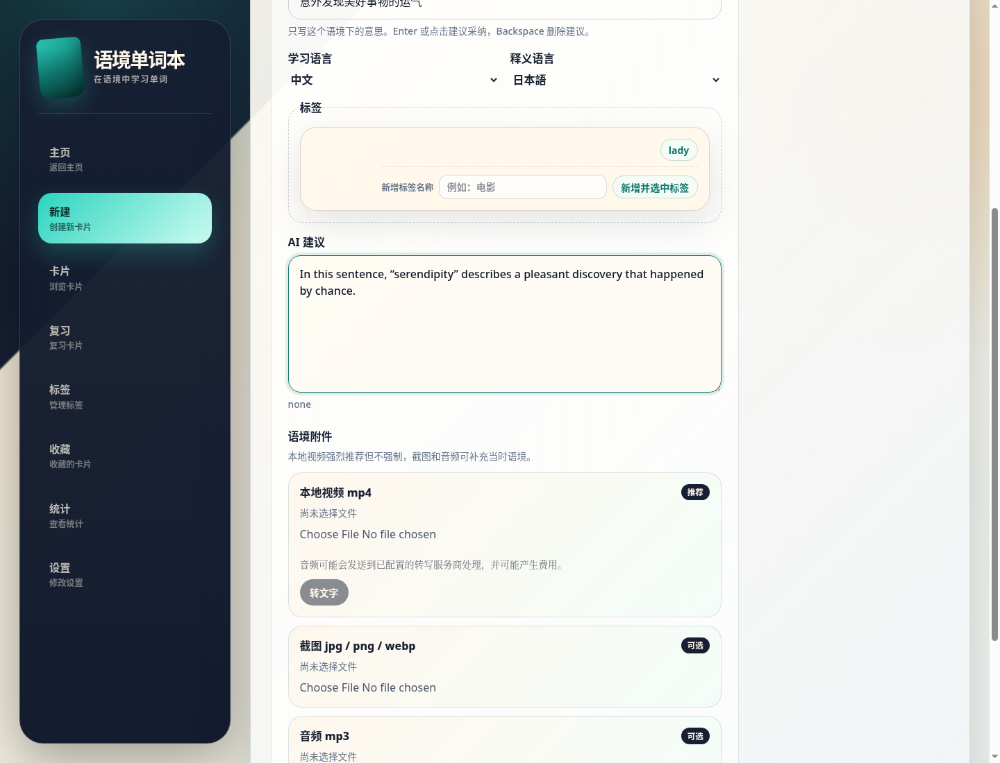

[中文](./README.md) | [English](./README.en.md) | [日本語](./README.ja.md) | [Español](./README.es.md) | [العربية](./README.ar.md) | [Deutsch](./README.de.md) | [Français](./README.fr.md) | [Italiano](./README.it.md) | [Latina](./README.la.md)

# Context Vocabulary Notebook (دفتر مفردات السياق)

دفتر مفردات محلي أولًا لتعلّم الكلمات من مقاطع الفيديو والصوت والترجمات والدروس الحقيقية.

بدلًا من حفظ كلمات معزولة، يحتفظ بالجملة، والمعنى في السياق، ولقطة الشاشة، ومقطع الفيديو/الصوت، والملاحظات، والعلامات من اللحظة التي وجدت فيها الكلمة. عند المراجعة لاحقًا، ترى السياق الحقيقي مرة أخرى، وليس كلمة وتعريفًا فقط.

مناسب لـ:

- تسجيل الكلمات الجديدة أثناء مشاهدة مقاطع فيديو أو دروس أو أفلام أو مواد استماع بلغة أجنبية.
- المتعلمين الذين يريدون تكرارًا متباعدًا شبيهًا بـ Anki، لكن مع سياق أغنى في كل بطاقة.
- من يفضلون بقاء البيانات محليًا ولا يريدون حسابًا سحابيًا لدفتر المفردات.

> المشروع الحالي عبارة عن تطبيق ويب محلي. يتم حفظ البيانات افتراضيًا في قاعدة بيانات SQLite ومجلد `uploads/` على جهاز الكمبيوتر الخاص بك. لا يلزم وجود حساب سحابي.

## Demo



## الميزات الرئيسية

- إنشاء بطاقات حول سياقات حقيقية: الكلمة الهدف، التعريف السياقي، الجملة الأصلية، الملاحظات، العلامات.
- حفظ مرفقات وسائط محلية: فيديو `mp4`، صوت `mp3`، صورة `jpg / png / webp`.
- ربط إدخال معنى واحد بعدة أمثلة سياقية، وهو مفيد لتسجيل نفس المعنى في مواد مختلفة.
- المراجعة باستخدام التكرار المتباعد FSRS مع إعادة كل كلمة إلى السياق الذي ظهرت فيه.
- قائمة إدخالات المعنى، البحث، التصفية حسب العلامة، المفضلة، الإحصائيات.
- استيراد وتصدير ZIP للنسخ الاحتياطي الشخصي الكامل ومشاركة البطاقات فقط.
- اقتراحات الذكاء الاصطناعي في صفحة إنشاء البطاقات V2: يمكن تكوين واجهة برمجة تطبيقات متوافقة مع OpenAI لاقتراح التعريفات السياقية وملاحظات الاستخدام؛ يتم حفظ مفتاح API محليًا فقط.

## موقع البيانات وتحذير مساحة القرص

يحفظ التطبيق البيانات في دليل التشغيل افتراضيًا. بعد تحميل مقاطع الفيديو ولقطات الشاشة والصوت، قد ينمو دليل `uploads/` باستمرار ويشغل مساحة كبيرة على القرص.

البيانات المحلية الافتراضية:

```text
data/context-vocabulary-notebook.sqlite
uploads/
.env
```

لا يُنصح بتشغيل التطبيق في هذه المواقع:

- الدلائل التي تتطلب عادةً أذونات `sudo` أو الجذر، مثل `/usr/local`، `/opt`.
- الدلائل المحمية بواسطة النظام مثل `C:\Program Files`.
- الدلائل المؤقتة، ودلائل ذاكرة التخزين المؤقت للتنزيل، أو المواقع التي سيتم حذفها تلقائيًا بواسطة النظام أو أدوات التنظيف.
- المواقع ذات المساحة القليلة جدًا، أو قواعد المزامنة غير الواضحة، أو حيث قد يتم تنظيف الملفات تلقائيًا أو تقييد حصتها بواسطة محركات الأقراص السحابية.

## بيئة التشغيل

| البيئة | المتطلبات | الوصف |
|------|------|------|
| Node.js | يوصى بإصدار Node.js 22 LTS؛ على الأقل إصدار Node يلبي متطلبات Vite الحالية | يعتمد كل من بناء الواجهة الأمامية وخادم التطوير وخادم الواجهة الخلفية على Node.js. سيحاول برنامج التثبيت النصي توفير ذلك. |
| npm | مثبت مع Node.js | يحتوي المستودع على `package-lock.json`، استخدم `npm ci` لتثبيت التبعيات. |
| Git | مطلوب لاستنساخ مستودع GitHub | سيتحقق برنامج التثبيت النصي ويحاول توفير ذلك. |
| المتصفح | المتصفحات الحديثة مثل Chrome / Edge / Firefox / Safari | يتم استخدام التطبيق عبر صفحات ويب محلية. |
| أدوات بناء C/C++ | قد تكون مطلوبة | `better-sqlite3` عبارة عن وحدة أصلية؛ إذا لم تتوفر حزمة مجمعة مسبقًا للنظام الحالي وإصدار Node، فسيحاول `npm ci` التجميع المحلي. |

سيتحقق برنامج التثبيت النصي أولاً من البيئة الموجودة على الجهاز المحلي. في Linux / WSL، سيحاول تلبية التبعيات عبر `apt-get` فقط إذا كان Git أو Node.js/npm مفقودًا؛ إذا تم استيفاء البيئات الأساسية، فسيتم تخطي `apt-get` لتجنب إثارة مشكلات مصادر برامج الجهات الخارجية غير ذات الصلة في النظام. سيحاول البرنامج النصي لنظام macOS استخدام Homebrew عند فقدان التبعيات. سيحاول البرنامج النصي الأصلي لنظام Windows استخدام `winget` عند فقدان التبعيات. إذا لم تكن مديري الحزم هذه متوفرة، أو إذا لم يكن لدى المستخدم الحالي أذونات التثبيت، فستحتاج إلى تثبيت البيئات المفقودة يدويًا والمحاولة مرة أخرى.

## ملاحظات ما قبل التثبيت وإخلاء المسؤولية

وفقًا لأفضل معلومات المؤلف الحالية، لا يحتوي الكود المصدري الخاص بهذا المشروع على أي تعليمات برمجية ضارة. سيتحقق برنامج التثبيت النصي من البيئة المحلية ويحاول تثبيت التبعيات المفقودة مثل Git و Node.js و npm وأدوات البناء الأصلية على الأنظمة الأساسية المدعومة.

سيجلب تثبيت المشروع برامج وتبعيات الجهات الخارجية عبر مديري حزم النظام و npm. قد تظل عملية التثبيت والاستخدام متأثرة بعوامل مثل أذونات النظام، وحالة الشبكة، وتوافر مدير الحزم، وبرامج مكافحة الفيروسات، وسياسات أجهزة الشركات، ومساحة القرص، وسلاسل التوريد لتبعيات الجهات الخارجية، ونتائج تجميع وحدة Node الأصلية. يتحمل المستخدمون وحدهم المسؤولية عن أي مشكلات وعواقب تنشأ عن تشغيل برنامج التثبيت النصي، وتثبيت التبعيات، وتعديل بيئة النظام، وتحميل الملفات المحلية وحفظها.

إذا لم يتمكن البرنامج النصي من تلبية البيئة تلقائيًا، فسيخرج الأدوات المفقودة وطرق المعالجة المقترحة؛ في هذه المرحلة، يحتاج المستخدمون إلى تثبيتها يدويًا وفقًا لأنظمتهم الخاصة قبل إعادة المحاولة.

## تثبيت بنقرة واحدة

### Linux / macOS / WSL

انسخ الأمر التالي وقم بتشغيله. سيقوم البرنامج النصي بتثبيت المشروع في الدليل الحالي:

```bash
mkdir -p "$HOME/context-vocabulary-notebook" && cd "$HOME/context-vocabulary-notebook"
curl --retry 5 --retry-delay 2 --retry-connrefused -fsSL https://raw.githubusercontent.com/yaqxuan/context-vocabulary-notebook/main/scripts/install.sh | bash
```

سيتحقق البرنامج النصي تلقائيًا من التبعيات مثل Git، Node.js/npm؛ سيتم إعادة استخدام التبعيات المثبتة مباشرة. بالنسبة لنظامي Linux / WSL، إذا تم استيفاء التبعيات الأساسية، فسيتم تخطي `apt-get`.

لعرض محتوى البرنامج النصي أولاً، قم بزيارة:
https://github.com/yaqxuan/context-vocabulary-notebook/blob/main/scripts/install.sh

الاستخدام المتقدم: تحديد دليل التثبيت

```bash
export CVN_HOME="$HOME/context-vocabulary-notebook"
curl --retry 5 --retry-delay 2 --retry-connrefused -fsSL https://raw.githubusercontent.com/yaqxuan/context-vocabulary-notebook/main/scripts/install.sh | bash
```

### Windows PowerShell

أولاً، أدخل دليلًا فارغًا حيث تريد تثبيت ملفات المشروع، ثم انسخ الأمر التالي وقم بتشغيله. سيقوم البرنامج النصي بتثبيت ملفات المشروع مباشرة في الدليل الحالي دون إنشاء دليل متداخل آخر:

```powershell
irm https://raw.githubusercontent.com/yaqxuan/context-vocabulary-notebook/main/scripts/install.ps1 -ErrorAction Stop | iex
```

سيتحقق البرنامج النصي تلقائيًا من التبعيات مثل Git، Node.js/npm؛ سيتم إعادة استخدام التبعيات المثبتة مباشرة.

لعرض محتوى البرنامج النصي أولاً، قم بزيارة:
https://github.com/yaqxuan/context-vocabulary-notebook/blob/main/scripts/install.ps1

الاستخدام المتقدم: تحديد دليل التثبيت

```powershell
$env:CVN_HOME = "C:\path\to\empty-folder"
irm https://raw.githubusercontent.com/yaqxuan/context-vocabulary-notebook/main/scripts/install.ps1 | iex
```

### استكشاف الأخطاء وإصلاحها

- إذا قيل إن الأمر غير موجود، فأغلق المحطة، وأعد فتحها، وقم بتشغيل أمر التثبيت مرة أخرى.
- بالنسبة لنظامي Linux / WSL، إذا أبلغ `apt-get update` عن أخطاء مثل Docker، Chromium، Snap، مفاتيح GPG، إلخ، فعادة ما يكون ذلك بسبب مصادر apt الحالية أو تكوينات الحزم غير المكتملة في النظام، وليس لأن هذا المشروع يعتمد على هذه البرامج. يمكنك إصلاح / تعطيل مصادر apt المقابلة أولاً، أو تثبيت Git و Node.js 20+ و npm يدويًا، ثم إعادة المحاولة.
- بالنسبة لنظام macOS، إذا انبثقت نافذة تثبيت أدوات سطر أوامر Xcode، فانقر فوق "تثبيت"، وبعد اكتمالها، أعد تشغيل أمر التثبيت.
- بالنسبة لنظام Windows، إذا طُلب منك تثبيت بيئة تجميع، فيرجى المتابعة كما هو مطلوب؛ هذه بيئة قد تكون مطلوبة أثناء تجميع بعض التبعيات.

## التحديث إلى أحدث إصدار

إذا كنت قد قمت بتثبيته بالفعل، فادخل إلى دليل المشروع وقم بتشغيل:

Linux / macOS / WSL / Git Bash:

```bash
cd context-vocabulary-notebook
git pull --ff-only
npm ci
npm run build
npm run dev
```

Windows native PowerShell:

```powershell
Set-Location context-vocabulary-notebook
git pull --ff-only
npm ci
npm run build
npm run dev
```

يمكنك أيضًا إعادة تشغيل أمر التثبيت بنقرة واحدة. عندما يجد البرنامج النصي مستودع Git موجودًا في دليل التثبيت، فسيقوم تلقائيًا بتنفيذ `git pull --ff-only` و `npm ci` و `npm run build`.

إذا أعدت تشغيل أمر التثبيت بنقرة واحدة داخل دليل المشروع، فسيقوم البرنامج النصي بتحديث دليل المشروع الحالي ولن يقوم بإنشاء دليل متداخل آخر بنفس الاسم. إذا كنت تعمل خارج المشروع، فيرجى إدخال دليل فارغ أولاً، أو تعيين نفس `CVN_HOME` بشكل صريح؛ لن يمزج البرنامج النصي ملفات المشروع في دليل عادي غير فارغ.

## التثبيت اليدوي

إذا تعذر على البرنامج النصي بنقرة واحدة تلبية البيئة، فيمكنك تثبيت Node.js 22 LTS و npm و Git وأدوات البناء الأصلية المطلوبة يدويًا أولاً، ثم تنفيذ الأوامر التالية.

Linux / macOS / WSL / Git Bash:

```bash
git clone https://github.com/yaqxuan/context-vocabulary-notebook.git
cd context-vocabulary-notebook
cp .env.example .env
npm ci
npm run dev
```

Windows native PowerShell:

```powershell
git clone https://github.com/yaqxuan/context-vocabulary-notebook.git
Set-Location context-vocabulary-notebook
Copy-Item .env.example .env
npm ci
npm run dev
```

افتح في المتصفح:

```text
http://localhost:5173
```

عنوان الواجهة الخلفية الافتراضي:

```text
http://localhost:3107
```

## متغيرات البيئة

## ffmpeg / Video transcription addendum

For video transcription, install local `ffmpeg`. The installer checks ffmpeg and reports its status; missing ffmpeg does not block the core install, card creation, review, or normal media upload.

Opt in to installer-managed ffmpeg installation before running the installer:

```bash
export CVN_INSTALL_FFMPEG=1
curl --retry 5 --retry-delay 2 --retry-connrefused -fsSL https://raw.githubusercontent.com/yaqxuan/context-vocabulary-notebook/main/scripts/install.sh | bash
```

```powershell
$env:CVN_INSTALL_FFMPEG = "1"
irm https://raw.githubusercontent.com/yaqxuan/context-vocabulary-notebook/main/scripts/install.ps1 -ErrorAction Stop | iex
```

If video transcription shows `Audio extraction failed`, install ffmpeg and retry: Linux / WSL `sudo apt-get update && sudo apt-get install -y ffmpeg`; macOS `brew install ffmpeg`; Windows `winget install Gyan.FFmpeg`, then reopen the terminal.

Video transcription prerequisites: local `ffmpeg` on PATH, a configured OpenAI-compatible `/audio/transcriptions` provider/model, and an uploaded file within the transcription size limit. `TRANSCRIPTION_UPLOAD_SIZE_LIMIT_BYTES` is currently 100MB; the media-library video attachment limit is 300MB.

<!-- AUTO-GENERATED:ENV -->
| المتغير | مطلوب | الافتراضي | الوصف |
|------|------|--------|------|
| `PORT` | لا | `3107` | منفذ خادم Express للواجهة الخلفية. يقوم خادم تطوير Vite بتوكيل `/api` إلى هذا المنفذ. |
| `DATABASE_PATH` | لا | `./data/context-vocabulary-notebook.sqlite` | مسار قاعدة بيانات SQLite. يتم حل المسارات النسبية مقابل جذر المشروع. |
| `UPLOADS_DIR` | لا | `./uploads` | دليل حفظ ملفات الوسائط المحملة. يتم حل المسارات النسبية مقابل جذر المشروع. |
<!-- /AUTO-GENERATED:ENV -->

لتغيير منفذ الواجهة الأمامية أثناء التطوير، يمكنك تعيين `CLIENT_PORT` عند تشغيل الأمر، والافتراضي هو `5173`. هذا المتغير غير موجود في `.env.example` وعادة لا يحتاج إلى تكوين.

## الأوامر الشائعة

<!-- AUTO-GENERATED:SCRIPTS -->
| الأمر | الوصف |
|------|------|
| `npm run dev` | يبدأ كلاً من خادم تطوير الواجهة الخلفية وخادم تطوير الواجهة الأمامية Vite. |
| `npm run dev:client` | يبدأ خادم تطوير الواجهة الأمامية Vite فقط، ويستمع إلى `0.0.0.0:5173` افتراضيًا. |
| `npm run dev:server` | يبدأ خادم تطوير Express للواجهة الخلفية فقط، ويستمع إلى `localhost:3107` افتراضيًا. |
| `npm run build` | يقوم بتشغيل التحقق من النوع أولاً، ثم يبني الواجهة الأمامية والواجهة الخلفية. |
| `npm test` | يقوم بتشغيل اختبارات الوحدة / التكامل Vitest. |
| `npm run test:e2e` | يقوم بتشغيل اختبارات Playwright E2E؛ يمر حتى مع عدم وجود ملفات اختبار. |
| `npm run typecheck` | يقوم بتشغيل التحقق من نوع TypeScript لجانبي الواجهة الأمامية و Node. |
| `npm run lint` | يعادل حاليًا `npm run typecheck`. |
<!-- /AUTO-GENERATED:SCRIPTS -->

## البيانات والنسخ الاحتياطي

البيانات الافتراضية موجودة داخل دليل المشروع:

```text
data/context-vocabulary-notebook.sqlite
uploads/
.env
```

يوصى بحفظها معًا عند النسخ الاحتياطي:

```bash
tar -czf vocabulary-notebook-backup.tar.gz data uploads .env
```

للاستعادة، أعد هذه الملفات إلى نفس دليل المشروع وابدأ التطبيق.

يتوفر أيضًا استيراد / تصدير ZIP داخل التطبيق:

- النسخ الاحتياطي الكامل: يتضمن البطاقات والسياقات والوسائط والعلامات والمفضلة وحالة المراجعة وحالة FSRS وسجلات المراجعة وإعدادات المستخدم.
- مشاركة البطاقات فقط: لا يتضمن تقدم المراجعة الشخصية أو حالة المفضلة أو إعدادات المستخدم.

يعد مفتاح AI API تكوينًا حساسًا محليًا ولن يتم نقله مع الملف المصدر؛ يجب ملؤه مرة أخرى بعد تغيير الأجهزة.

## توصيات ملفات الوسائط

| النوع | التنسيقات المدعومة | الحجم الموصى به |
|------|----------|----------|
| فيديو | `mp4` | أقل من 300 ميغابايت لكل ملف |
| صوت | `mp3` | أقل من 50 ميغابايت لكل ملف |
| صورة | `jpg` / `png` / `webp` | أقل من 10 ميغابايت لكل ملف |

## تكوين اقتراحات الذكاء الاصطناعي

تدعم صفحة إنشاء البطاقات اقتراحات الذكاء الاصطناعي الاختيارية. تحتاج إلى إضافة تكوينات API متوافقة مع OpenAI في صفحة الإعدادات:

- اسم العرض
- URL الأساسي
- مفتاح API
- النموذج

ملاحظة:

- يعمل إنشاء البطاقات اليدوي والمراجعة بشكل مثالي بدون تكوين الذكاء الاصطناعي.
- يتم تخزين مفتاح API في قاعدة البيانات المحلية وسيتم إخفاؤه على واجهة المستخدم.
- لن يتم تضمين مفتاح API في الملفات المصدرة.
- يُستخدم الذكاء الاصطناعي فقط لاقتراح التعريفات السياقية وملاحظات الاستخدام أثناء إنشاء البطاقات. إنه ليس قاموسًا مدمجًا، ولا يقوم بإنشاء البطاقات تلقائيًا.

## أسئلة مكررة (FAQ)

### المنفذ مشغول

تعديل `.env`:

```env
PORT=3108
```

إذا كان منفذ الواجهة الأمامية `5173` مشغولاً:

```bash
CLIENT_PORT=5174 npm run dev
```

### فشل npm ci في better-sqlite3

فضل استخدام Node.js 22 LTS. `better-sqlite3` عبارة عن وحدة أصلية؛ إذا لم تتوفر حزمة مجمعة مسبقًا للنظام الحالي وإصدار Node، فسيحاول التجميع المحلي أثناء التثبيت.

Linux / WSL:

```bash
sudo apt update
sudo apt install -y build-essential python3 make g++
```

macOS:

```bash
xcode-select --install
```

تتطلب بيئة Windows الأصلية بيئات بناء أصلية Python و Visual Studio Build Tools / MSVC متوفرة. إذا لم تكن على دراية بتكوين هذه الأدوات، فمن المستحسن استخدام WSL بدلاً من ذلك، أو تثبيت البيئات المفقودة يدويًا أولاً والمحاولة مرة أخرى.

### تفتح الصفحة، لكن طلبات API تفشل

تأكد من تشغيل الواجهة الخلفية:

```text
http://localhost:3107/api/health
```

استجابة طبيعية:

```json
{"ok":true}
```

### أريد تغيير دليل التثبيت

فقط انقل دليل المشروع بأكمله. إذا كان `.env` يستخدم مسارات نسبية، فسيستمر حل قاعدة البيانات ودليل التحميلات بالنسبة للدليل الجديد. إذا كان `.env` يستخدم مسارات مطلقة، فيجب تحديثها بشكل متزامن.

## ملاحظات التطوير

المجموعة التقنية لهذا المشروع:

- React + Vite
- Node.js + Express
- SQLite + better-sqlite3
- ts-fsrs
- Tailwind CSS
- Vitest
- Playwright

يلتزم الإصدار الأول بالأولوية المحلية، ولا قواميس مدمجة، ولا اتصالات قواميس، ولا روابط فيديو لمواقع الويب، ولا مزامنة. يضيف V2 الحالي إمكانيات اقتراح الذكاء الاصطناعي أثناء إنشاء البطاقات فقط.

## الترخيص

يستخدم هذا المشروع ترخيص MIT. انظر [`LICENSE`](./LICENSE) للحصول على التفاصيل.
