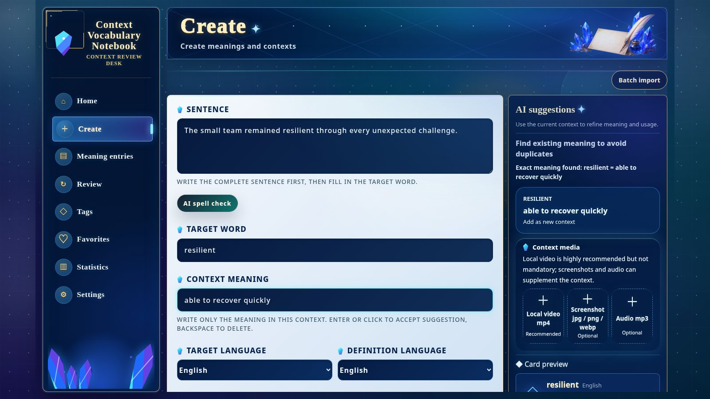

[English](./README.md) | [简体中文](./README.zh-CN.md) | [日本語](./README.ja.md) | [Español](./README.es.md) | [العربية](./README.ar.md) | [Deutsch](./README.de.md) | [Français](./README.fr.md) | [Italiano](./README.it.md) | [한국어](./README.ko.md) | [Русский](./README.ru.md) | [Latina](./README.la.md)

# Context Vocabulary Notebook (دفتر مفردات السياق)

احفظ الكلمة مع الجملة أو الصورة أو الصوت أو الفيديو الذي صادفتها فيه فعلاً.

> **ملاحظة اللغة:** هذه الوثيقة مترجمة إلى العربية، لكن واجهة التطبيق العربية غير متاحة حالياً.
> تعرض صورة المعاينة أدناه الواجهة الإنجليزية.

<!-- README:OVERVIEW -->
## تعلّم الكلمة في سياقها الحقيقي

Context Vocabulary Notebook تطبيق ذاتي الاستضافة ومحلي أولاً. تجمع البطاقة الكلمة ومعناها
في السياق والجملة الأصلية والوسوم والملاحظات والوسائط الاختيارية. يحدد FSRS المراجعات،
وتجيب بـ `Again` أو `Good`.

ليس قاموساً جاهزاً ولا خدمة مزامنة سحابية ولا برنامج سطح مكتب أصلياً؛ إنه تطبيق ويب محلي
للمفردات التي تجمعها بنفسك.

<!-- README:PREVIEW -->
## المعاينة



شاشات أخرى: [تفاصيل البطاقة](./docs/demo/screen-card-detail.jpg)،
[المراجعة](./docs/demo/screen-review.jpg)، [الإحصاءات](./docs/demo/screen-statistics.jpg).

<!-- README:WORKFLOW -->
## دورة الدراسة

1. سجّل الجملة والكلمة المستهدفة ومعناها في السياق.
2. أرفق `mp4` أو `mp3` أو `jpg` أو `png` أو `webp`.
3. نظّم المحتوى بالوسوم والمفضلة والملاحظات والبحث والمرشحات.
4. راجع باستخدام `Again / Good` ودع FSRS يختار الموعد التالي.
5. راقب عدد المراجعات والدقة وتوزيع الوسوم واتجاه التقييمات.

تعالج ميزة الاستيراد الدفعي عدة **مقاطع MP4 محلية** وتتيح تأكيد كل نتيجة قبل الحفظ.
لا تدعم روابط مواقع الفيديو.

<!-- README:FEATURES -->
## القدرات الحالية

| المجال | القدرة |
|---|---|
| بطاقات السياق | الجملة والمعنى والملاحظات والوسوم وأمثلة سياق متعددة. |
| الوسائط | ملفات `mp4` و`mp3` و`jpg` و`png` و`webp` محلية. |
| المراجعة | FSRS و`Again / Good` والتقدم اليومي وتشغيل الوسائط. |
| المكتبة | البحث والمرشحات والمفضلة والوسوم والتحرير وحالة الإتقان. |
| الإحصاءات | عدد المراجعات والدقة والمجاميع الشهرية والوسوم واتجاه التقييمات. |
| النقل | ZIP للنسخ الاحتياطي الشخصي أو مشاركة البطاقات. |
| التعرف المحلي | ffmpeg وTesseract OCR وwhisper.cpp STT اختيارية. |
| الذكاء الاصطناعي | اقتراحات اختيارية عبر API من نوع OpenAI-compatible. |

<!-- README:QUICKSTART -->
## بدء سريع

تحتاج Git وnpm وNode.js `20.19+` أو `22.12+` (يوصى بـ Node.js 22 LTS).

شغّل المثبّت من مجلد فارغ. يُثبَّت المشروع مباشرة في المجلد الحالي ولا ينشئ
مجلد `context-vocabulary-notebook` متداخلاً.

Linux أو macOS أو WSL:

```bash
curl --retry 5 --retry-delay 2 --retry-connrefused -fsSL https://raw.githubusercontent.com/yaqxuan/context-vocabulary-notebook/main/scripts/install.sh | bash
```

Windows PowerShell:

```powershell
irm https://raw.githubusercontent.com/yaqxuan/context-vocabulary-notebook/main/scripts/install.ps1 -ErrorAction Stop | iex
```

شغّل التطبيق:

```bash
npm run dev
```

افتح <http://localhost:5173>. فحص API:
<http://localhost:3107/api/health>. أنشئ أول بطاقة يدوياً ثم جرّب المراجعة.

<!-- README:OPTIONAL -->
## التعرف والذكاء الاصطناعي الاختياريان

يستخرج ffmpeg الوسائط، ويقرأ Tesseract النص المرئي، وينسخ whisper.cpp مع نموذج Whisper
الكلام. تثبيت التعرف منفصل عن التطبيق بسبب حجم النموذج.

```bash
curl --retry 5 --retry-delay 2 --retry-connrefused -fsSL https://raw.githubusercontent.com/yaqxuan/context-vocabulary-notebook/main/scripts/install-recognition.sh | CVN_TESSERACT_LANG=ara bash
```

```powershell
$env:CVN_TESSERACT_LANG='ara'; irm https://raw.githubusercontent.com/yaqxuan/context-vocabulary-notebook/main/scripts/install-recognition-windows.ps1 -ErrorAction Stop | iex
```

تستخدم اقتراحات AI خدمة OpenAI-compatible تضبطها أنت. إنشاء البطاقات يدوياً والمراجعة لا
يتطلبان OCR أو STT أو AI.

<!-- README:PRIVACY -->
## الخصوصية والبيانات

تبقى البيانات افتراضياً داخل مجلد التثبيت:

```text
data/context-vocabulary-notebook.sqlite
uploads/
.env
```

لا توجد مزامنة سحابية مدمجة. يبقي العمل اليدوي وOCR/STT المحلي المحتوى على جهازك.
عند إعداد مزود AI شبكي، تُرسل النصوص لاقتراحات AI والصوت لنسخ البطاقة. ولا تُرسل إطارات
المقطع أو صوته بعد فشل التعرف المحلي إلا مع `CVN_CLIP_ANALYSIS_CLOUD_FALLBACK=1`.
يبقى مفتاح API محلياً ولا يدخل في ملفات ZIP التي يصدرها التطبيق.

<!-- README:DOCS -->
## الوثائق

- [دليل المستخدم الكامل بالإنجليزية](./docs/USER_GUIDE.md)
- [دليل المستخدم الكامل بالصينية](./docs/USER_GUIDE.zh-CN.md)
- [دليل المساهمة](./CONTRIBUTING.md)
- [سياسة الأمان](./SECURITY.md)
- [قواعد السلوك](./CODE_OF_CONDUCT.md)

يغطي الدليل الكامل التحديث وWindows/WSL وOCR/STT ومتغيرات البيئة والنسخ الاحتياطي واستكشاف الأخطاء.

<!-- README:STATUS -->
## حالة المشروع

هذا إصدار أولي مبكر للاستخدام المحلي ذاتي الاستضافة. انسخ `data/` و`uploads/` و`.env`
احتياطياً قبل التغييرات الكبيرة.

لغات الواجهة الحالية: الإنجليزية والصينية المبسطة واليابانية والكورية والفرنسية والألمانية
والإسبانية والروسية. **الواجهة العربية غير متاحة حالياً.**

<!-- README:CONTRIBUTING -->
## المساهمة

نرحب بتقارير الأخطاء والاقتراحات المحددة والترجمات وطلبات السحب المختبرة. اقرأ
[CONTRIBUTING.md](./CONTRIBUTING.md) ولا تنشر مفرداتك أو وسائطك أو قاعدة بياناتك أو مفاتيح API.

<!-- README:LICENSE -->
## الرخصة

[MIT](./LICENSE)
