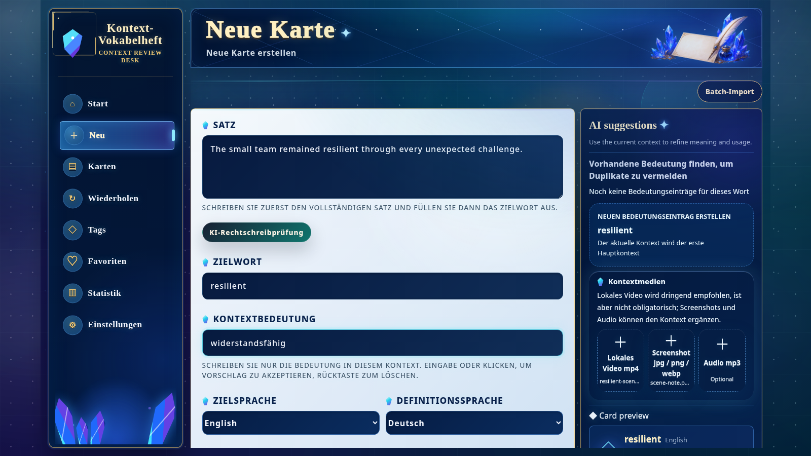

[English](./README.md) | [简体中文](./README.zh-CN.md) | [日本語](./README.ja.md) | [Español](./README.es.md) | [العربية](./README.ar.md) | [Deutsch](./README.de.md) | [Français](./README.fr.md) | [Italiano](./README.it.md) | [한국어](./README.ko.md) | [Русский](./README.ru.md) | [Latina](./README.la.md)

# Context Vocabulary Notebook (Kontext-Vokabelheft)

Speichere ein Wort zusammen mit dem Satz, Bild, Audio oder Video, in dem du ihm begegnet bist.

<!-- README:OVERVIEW -->
## Wörter im echten Kontext lernen

Context Vocabulary Notebook ist eine selbst gehostete, lokale Lernanwendung. Eine Karte
verbindet Zielwort, Bedeutung im aktuellen Kontext, Originalsatz, Tags, Notizen und optionale
Medien. FSRS plant Wiederholungen; du antwortest mit `Again` oder `Good`.

Es ist weder ein fertiges Wörterbuch noch ein Cloud-Synchronisierungsdienst oder natives
Desktopprogramm. Es ist eine lokale Web-App für selbst gesammelte Wörter.

<!-- README:PREVIEW -->
## Vorschau



Weitere Ansichten: [Kartendetail](./docs/demo/02-context-card.png),
[Wiederholung](./docs/demo/03-review.png), [Statistik](./docs/demo/04-statistics.png).

<!-- README:WORKFLOW -->
## Lernablauf

1. Originalsatz, Zielwort und kontextbezogene Bedeutung erfassen.
2. `mp4`, `mp3`, `jpg`, `png` oder `webp` als Kontext anhängen.
3. Mit Tags, Favoriten, Notizen, Suche und Filtern organisieren.
4. Mit `Again / Good` wiederholen; FSRS wählt das nächste Intervall.
5. Menge, Genauigkeit, Tag-Verteilung und Bewertungen auswerten.

Der Stapelimport verarbeitet mehrere **lokale MP4-Clips** und lässt jedes Ergebnis vor dem
Speichern prüfen. URLs von Video-Websites werden nicht unterstützt.

<!-- README:FEATURES -->
## Aktuelle Funktionen

| Bereich | Funktion |
|---|---|
| Kontextkarten | Satz, Bedeutung, Notizen, Tags und mehrere Kontextbeispiele. |
| Medien | Lokale `mp4`, `mp3`, `jpg`, `png` und `webp`. |
| Wiederholung | FSRS, `Again / Good`, Tagesfortschritt, Medienwiedergabe. |
| Bibliothek | Suche, Filter, Favoriten, Tags, Bearbeitung, Beherrscht-Status. |
| Statistik | Wiederholungszahl, Genauigkeit, Monatssummen, Tags und Bewertungstrends. |
| Portabilität | ZIP für persönliche Sicherung oder geteilte Karten. |
| Erkennung | Optionale ffmpeg-, Tesseract-OCR- und whisper.cpp-STT-Werkzeuge. |
| KI | Optionale Vorschläge über eine OpenAI-compatible API. |

<!-- README:QUICKSTART -->
## Schnellstart

Benötigt werden Git, npm und Node.js `20.19+` oder `22.12+` (Node.js 22 LTS empfohlen).

Führe den Installer in einem leeren Verzeichnis aus. Das Projekt wird direkt dort
installiert; es entsteht kein verschachtelter Ordner `context-vocabulary-notebook`.

Linux, macOS oder WSL:

```bash
curl --retry 5 --retry-delay 2 --retry-connrefused -fsSL https://raw.githubusercontent.com/yaqxuan/context-vocabulary-notebook/main/scripts/install.sh | bash
```

Windows PowerShell:

```powershell
irm https://raw.githubusercontent.com/yaqxuan/context-vocabulary-notebook/main/scripts/install.ps1 -ErrorAction Stop | iex
```

Starten:

```bash
npm run dev
```

Öffne <http://localhost:5173>. API-Prüfung:
<http://localhost:3107/api/health>. Erstelle zuerst eine Karte manuell.

<!-- README:OPTIONAL -->
## Optionale Erkennung und KI

ffmpeg extrahiert Medien, Tesseract liest sichtbaren Text und whisper.cpp transkribiert mit
einem Whisper-Modell Sprache. Wegen der Modellgröße ist die Erkennung separat zu installieren.

```bash
curl --retry 5 --retry-delay 2 --retry-connrefused -fsSL https://raw.githubusercontent.com/yaqxuan/context-vocabulary-notebook/main/scripts/install-recognition.sh | CVN_TESSERACT_LANG=deu bash
```

```powershell
$env:CVN_TESSERACT_LANG='deu'; irm https://raw.githubusercontent.com/yaqxuan/context-vocabulary-notebook/main/scripts/install-recognition-windows.ps1 -ErrorAction Stop | iex
```

KI-Vorschläge verwenden eine von dir eingerichtete OpenAI-compatible API. Manuelles Erstellen
und Wiederholen funktioniert ohne OCR, STT oder KI.

<!-- README:PRIVACY -->
## Datenschutz und Daten

Standardmäßig bleiben die Daten im Installationsordner:

```text
data/context-vocabulary-notebook.sqlite
uploads/
.env
```

Es gibt keine integrierte Cloud-Synchronisierung. Manuelle Arbeit und lokale OCR/STT behalten
Inhalte auf deinem Gerät. Ein konfigurierter Netzwerk-KI-Anbieter erhält Text für KI-Vorschläge
und Audio bei der Karten-Transkription. Nur mit `CVN_CLIP_ANALYSIS_CLOUD_FALLBACK=1` können
nach einem lokalen Erkennungsfehler Clip-Frames oder Audio gesendet werden. API-Schlüssel
bleiben lokal und fehlen in den ZIP-Exporten der App.

<!-- README:DOCS -->
## Dokumentation

- [Vollständiges englisches Benutzerhandbuch](./docs/USER_GUIDE.md)
- [Vollständiges chinesisches Benutzerhandbuch](./docs/USER_GUIDE.zh-CN.md)
- [Mitwirken](./CONTRIBUTING.md)
- [Sicherheitsrichtlinie](./SECURITY.md)
- [Verhaltenskodex](./CODE_OF_CONDUCT.md)

Updates, Windows/WSL, OCR/STT, Umgebungsvariablen, Backups und Fehlerbehebung stehen im
vollständigen Handbuch.

<!-- README:STATUS -->
## Projektstatus

Dies ist eine frühe Vorabversion für lokale, selbst gehostete Nutzung. Sichere vor größeren
Änderungen `data/`, `uploads/` und `.env`.

Aktuelle UI-Sprachen: Englisch, vereinfachtes Chinesisch, Japanisch, Koreanisch, Französisch,
Deutsch, Spanisch und Russisch.

<!-- README:CONTRIBUTING -->
## Mitwirken

Fehlerberichte, klar abgegrenzte Vorschläge, Übersetzungen und getestete PRs sind willkommen.
Lies [CONTRIBUTING.md](./CONTRIBUTING.md) und veröffentliche keine privaten Wörter, Medien,
Datenbanken oder API-Schlüssel.

<!-- README:LICENSE -->
## Lizenz

[MIT](./LICENSE)
