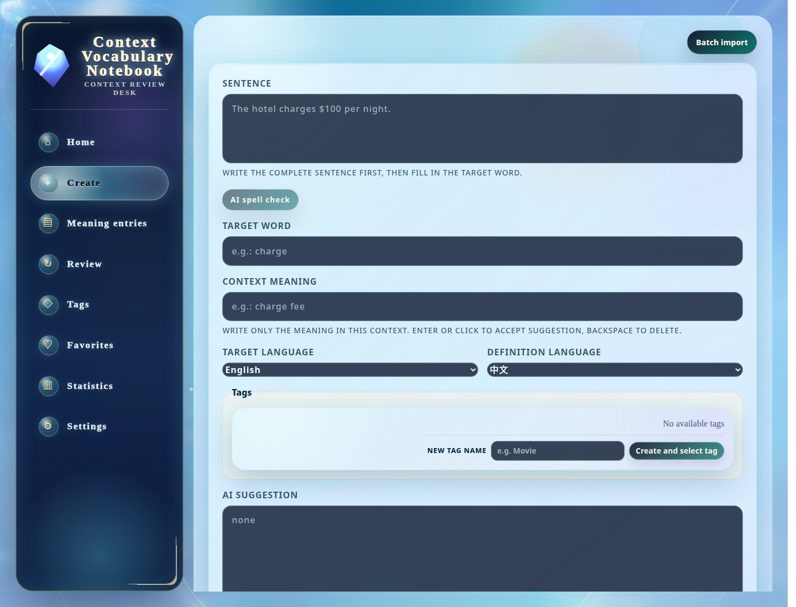

[中文](./README.md) | [English](./README.en.md) | [日本語](./README.ja.md) | [Español](./README.es.md) | [العربية](./README.ar.md) | [Deutsch](./README.de.md) | [Français](./README.fr.md) | [Italiano](./README.it.md) | [Latina](./README.la.md)

# Context Vocabulary Notebook

When you encounter a new word while watching videos, listening to courses, or reading subtitles, this app saves not only “the word itself” but also the original sentence, surrounding context, screenshot, audio/video clip, notes, and tags.

When reviewing, you see the real scene where you met the word, not an isolated vocabulary item.

It is for you if you:

- Often watch foreign-language videos, courses, films, podcasts, or listening materials.
- Want Anki-like spaced review, but with cards that keep the original sentence, screenshots, and media clips.
- Want your learning data on your own computer, without registering a cloud account just for a vocabulary notebook.
- Need help recognizing sentences from local videos, audio, or images before manually polishing them into cards.

> This project is a local web app. By default, data is stored in a SQLite database and `uploads/` folder on your computer; no cloud account is required.

## Demo



## What you can do with it

- Create cards around real context: target word, original sentence, contextual meaning, notes, and tags.
- Save local media attachments: video `mp4`, audio `mp3`, images `jpg / png / webp`.
- Batch-import clips: import multiple video, audio, or image clips at once, inspect recognition results one by one, and create cards.
- Use optional local OCR/STT helpers: configure ffmpeg, Tesseract, and whisper.cpp to recognize sentences from images, video frames, or audio.
- Attach multiple context examples to the same word meaning, useful for seeing how one meaning appears in different materials.
- Review with FSRS spaced repetition, bringing each word back into the context where you found it.
- Search, filter by tags, favorite, view stats, and import/export ZIP backups.
- Optional AI suggestions: after configuring an OpenAI-compatible API, get help with contextual meanings, usage notes, full-sentence translation, lemmatization, and spell checking.

## Data location and disk-space reminder

Choose the installation directory first. By default, the app keeps the database, uploaded files, and configuration under the directory where it runs.

Default local data:

```text
data/context-vocabulary-notebook.sqlite
uploads/
.env
```

Note: after uploading videos, audio, and screenshots, `uploads/` can keep growing. Whisper models may also take hundreds of MB to several GB.

Avoid running it in these locations:

- `/usr/local`, `/opt`, or other directories that usually require `sudo` or root permissions.
- `C:\Program Files` or other system-protected directories.
- Temporary folders, download caches, or locations that the system or cleanup tools may delete automatically.
- Locations with little free space, unclear sync rules, or cloud-drive cleanup/quota behavior.

Prefer a place you can keep long-term, for example:

```text
D:\study\context-vocabulary-notebook
E:\study\context
$HOME/context-vocabulary-notebook
```

## One-click install

Enter an empty directory where you want the project files to live, then run the command for your system. The script installs the project into the current directory; if the directory already contains this project, it updates it automatically.

| System | Command |
|------|------|
| Linux / macOS / WSL | See the Linux / macOS / WSL command below |
| Windows PowerShell | See the Windows PowerShell command below |

### Linux / macOS / WSL

```bash
curl --retry 5 --retry-delay 2 --retry-connrefused -fsSL https://raw.githubusercontent.com/yaqxuan/context-vocabulary-notebook/main/scripts/install.sh | bash
```

### Windows PowerShell

```powershell
irm https://raw.githubusercontent.com/yaqxuan/context-vocabulary-notebook/main/scripts/install.ps1 -ErrorAction Stop | iex
```

After installation, start it with:

```bash
npm run dev
```

Open in your browser:

```text
http://localhost:5173
```

Backend health check:

```text
http://localhost:3107/api/health
```

## Update to the latest version

Enter the directory where you installed the project, then run:

Linux / macOS / WSL / Git Bash:

```bash
git pull --ff-only
npm ci
npm run build
npm run dev
```

Windows PowerShell:

```powershell
git pull --ff-only
npm ci
npm run build
npm run dev
```

You can also rerun the one-click install command. If the script detects that the current directory is already this project, it updates, installs dependencies, and builds automatically.

## Local Clip Recognition (OCR / STT) (optional)

The core notebook does not require OCR/STT. You can create cards and review manually first; configure these tools only when you need to automatically recognize original sentences from videos, audio, or images.

Local recognition uses:

- ffmpeg: extract audio from videos.
- Tesseract: recognize text in images or video frames.
- whisper.cpp + Whisper model: recognize speech in audio or video.

### Configure local recognition automatically (recommended first try)

Run this in the project directory:

Linux / macOS / WSL:

```bash
curl --retry 5 --retry-delay 2 --retry-connrefused -fsSL https://raw.githubusercontent.com/yaqxuan/context-vocabulary-notebook/main/scripts/install-recognition.sh | bash
```

Windows PowerShell:

```powershell
$env:CVN_TESSERACT_LANG='eng'; irm https://raw.githubusercontent.com/yaqxuan/context-vocabulary-notebook/main/scripts/install-recognition-windows.ps1 -ErrorAction Stop | iex
```

To recognize Chinese and English subtitles, change the language to:

```powershell
$env:CVN_TESSERACT_LANG='eng+chi_sim'; irm https://raw.githubusercontent.com/yaqxuan/context-vocabulary-notebook/main/scripts/install-recognition-windows.ps1 -ErrorAction Stop | iex
```

After the script finishes, click **I installed it, check again** on the local-recognition card in the app settings page. Newer versions reload `.env`, so you usually do not need to restart the backend manually.

### Models and disk usage

Whisper models are large, and download time depends on your network:

- `tiny` / `base`: small and fast, good for trying it out, with lower accuracy.
- `small` / `medium`: better accuracy, with higher disk and CPU usage.
- `large`: very large and may be slow on ordinary computers; not recommended as the default choice.

The Windows recognition installer downloads `ggml-small.bin` by default, about several hundred MB.

### Configure local recognition manually

If one-click configuration fails, or if you want to manage tool paths yourself, install the tools manually and write these values into `.env`:

```env
CVN_FFMPEG_PATH=/absolute/path/to/ffmpeg

CVN_STT_PROVIDER=whisper.cpp
CVN_WHISPER_CPP_PATH=/absolute/path/to/whisper-cli
CVN_WHISPER_CPP_MODEL=/absolute/path/to/ggml-small.bin
CVN_WHISPER_CPP_TIMEOUT_MS=120000

CVN_OCR_PROVIDER=tesseract
CVN_TESSERACT_PATH=/absolute/path/to/tesseract
CVN_TESSERACT_LANG=eng
CVN_TESSERACT_TIMEOUT_MS=30000
```

Windows path example:

```env
CVN_FFMPEG_PATH=E:\study\context\tools\ffmpeg\bin\ffmpeg.exe
CVN_WHISPER_CPP_PATH=E:\study\context\tools\whisper.cpp\Release\whisper-cli.exe
CVN_WHISPER_CPP_MODEL=E:\study\context\models\ggml-small.bin
CVN_TESSERACT_PATH=E:\study\context\tools\tesseract\tesseract.exe
CVN_TESSERACT_LANG=eng+chi_sim
```


## Advanced installation options

### Specify installation directory

Linux / macOS / WSL:

```bash
export CVN_HOME="$HOME/context-vocabulary-notebook"
curl --retry 5 --retry-delay 2 --retry-connrefused -fsSL https://raw.githubusercontent.com/yaqxuan/context-vocabulary-notebook/main/scripts/install.sh | bash
```

Windows PowerShell:

```powershell
$env:CVN_HOME = "C:\path\to\empty-folder"
irm https://raw.githubusercontent.com/yaqxuan/context-vocabulary-notebook/main/scripts/install.ps1 -ErrorAction Stop | iex
```

### Let the core installer try to add optional tools

These are not required for ordinary first-time installation. Use them only when needed.

Linux / macOS / WSL:

```bash
export CVN_INSTALL_FFMPEG=1
export CVN_INSTALL_TESSERACT=1
curl --retry 5 --retry-delay 2 --retry-connrefused -fsSL https://raw.githubusercontent.com/yaqxuan/context-vocabulary-notebook/main/scripts/install.sh | bash
```

Windows PowerShell:

```powershell
$env:CVN_INSTALL_FFMPEG = "1"
$env:CVN_INSTALL_TESSERACT = "1"
irm https://raw.githubusercontent.com/yaqxuan/context-vocabulary-notebook/main/scripts/install.ps1 -ErrorAction Stop | iex
```

Installer source:

- Linux / macOS / WSL: https://github.com/yaqxuan/context-vocabulary-notebook/blob/main/scripts/install.sh
- Windows PowerShell: https://github.com/yaqxuan/context-vocabulary-notebook/blob/main/scripts/install.ps1

## Manual installation

If the one-click scripts cannot prepare the environment, manually install Node.js 22 LTS, npm, Git, and any required native build tools first, then run:

Linux / macOS / WSL / Git Bash:

```bash
cd "$HOME"
git clone https://github.com/yaqxuan/context-vocabulary-notebook.git context-vocabulary-notebook
cd context-vocabulary-notebook
cp .env.example .env
npm ci
npm run dev
```

Windows PowerShell:

```powershell
Set-Location $HOME
git clone https://github.com/yaqxuan/context-vocabulary-notebook.git context-vocabulary-notebook
Set-Location context-vocabulary-notebook
Copy-Item .env.example .env
npm ci
npm run dev
```

Open in your browser:

```text
http://localhost:5173
```

## FAQ

### What if one-click install fails?

- If the message says a command is missing, close and reopen the terminal, then run the installer again.
- Linux / WSL: if `apt-get update` reports Docker, Chromium, Snap, GPG key, or similar errors, it is usually an existing apt-source or unfinished package-configuration issue, not because this project depends on those packages. Fix/disable the affected apt source first, or manually install Git, Node.js 22 LTS, and npm before retrying.
- macOS: if the Xcode Command Line Tools prompt appears, click Install, then rerun the installer after it completes.
- Windows: if `npm ci` fails at `better-sqlite3`, you usually need Python and Visual Studio Build Tools / MSVC; if you are not familiar with these tools, WSL is recommended.

### The page opens, but local recognition still says not configured

First make sure the recognition installer has completed and the corresponding `CVN_*` paths exist in `.env`. Then click **I installed it, check again** on the settings page.

If it still does not work:

- Make sure the app was started from the same project directory.
- Make sure no old `3107` backend process is occupying the port.
- Run `npm run dev` again and refresh the page.

### Port is already in use

Change the backend port:

```env
PORT=3108
```

Linux / macOS / WSL / Git Bash change the frontend port:

```bash
CLIENT_PORT=5174 npm run dev
```

Windows PowerShell change the frontend port:

```powershell
$env:CLIENT_PORT = "5174"
npm run dev
```

### The clip has no visible subtitles, so no original sentence is recognized

If the video frame has no subtitles, or the subtitles are tiny/blurry, OCR may not find a sentence; in that case speech recognition is needed. Confirm that ffmpeg, whisper.cpp, and `CVN_WHISPER_CPP_MODEL` are available. If the audio also lacks clear speech, enter the original sentence manually.

If you see `Audio extraction failed`, ffmpeg is usually unavailable, the path is incorrect, or the source video/audio file cannot be read by ffmpeg.

### Missing Tesseract language data

If OCR reports missing language data, Tesseract was found but the matching traineddata is not installed. Common language codes:

- English: `eng`
- Simplified Chinese: `chi_sim`
- Japanese: `jpn`
- Korean: `kor`
- French: `fra`
- German: `deu`
- Spanish: `spa`
- Russian: `rus`

For multiple languages:

```env
CVN_TESSERACT_LANG=eng+chi_sim
```

### Whisper model path is not configured

`CVN_WHISPER_CPP_MODEL` has no default model. Download a ggml model supported by whisper.cpp and write its absolute path into `.env`.

## Data and backup

By default, all data is under the project directory:

```text
data/context-vocabulary-notebook.sqlite
uploads/
.env
```

For backup, save them together:

```bash
tar -czf vocabulary-notebook-backup.tar.gz data uploads .env
```

To restore, put these files back into the same project directory and start the app.

The app also provides ZIP import/export:

- Full backup: includes cards, contexts, media, tags, favorites, review state, FSRS state, review logs, and user settings.
- Card-only sharing: excludes personal review progress, favorite state, and user settings.

AI API Keys are local sensitive configuration and are not included in exports; you need to enter them again on another device.

## Media file recommendations

| Type | Supported formats | Recommended size |
|------|----------|----------|
| Video | `mp4` | within 300MB per file |
| Audio | `mp3` | within 50MB per file |
| Image | `jpg` / `png` / `webp` | within 10MB per file |

## AI suggestion configuration

The card creation page supports optional AI suggestions. Add an OpenAI-compatible API configuration on the settings page:

- Display name
- Base URL
- API Key
- Model

Notes:

- Without AI configuration, manual card creation and review still work normally.
- The API Key is stored in the local database and masked in the UI.
- The API Key is not included in export files.
- AI can suggest contextual meanings, usage notes, full-sentence translations, lemmatization, and spell checks during card creation.
- OpenAI-compatible text models such as DeepSeek do not perform local OCR/STT; image text recognition depends on Tesseract, and speech recognition depends on whisper.cpp.

## Requirements

| Environment | Requirement | Notes |
|------|------|------|
| Node.js | Node.js 22 LTS recommended | Frontend build, development servers, and backend service all depend on Node.js. The installer tries to provide it. |
| npm | Installed with Node.js | The repository includes `package-lock.json`; dependencies are installed with `npm ci`. |
| Git | Required when cloning from GitHub | The installer checks for it and tries to provide it. |
| Browser | Chrome / Edge / Firefox / Safari or another modern browser | The app is used through a local web page. |
| C/C++ build tools | May be required | `better-sqlite3` is a native module; if no prebuilt package is available, `npm ci` tries to compile it locally. |
| ffmpeg | Optional | Required for video/audio clip analysis. |
| Tesseract OCR | Optional | Required for OCR on images or video frames. |
| whisper.cpp + Whisper model | Optional | Required for speech recognition on audio/video. |

### WSL / native Windows recommendation

- WSL is usually the most stable: Node, Git, ffmpeg, Tesseract, and native build tools are closer to Linux paths.
- Native Windows PowerShell is supported: the script reuses existing Git / Node.js / npm and tries `winget` only when something is missing.
- If native Windows `npm ci` fails at `better-sqlite3`, install Python and Visual Studio Build Tools / MSVC as prompted, or use WSL.

## Environment variables

<!-- AUTO-GENERATED:ENV -->
| Variable | Required | Default | Description |
|------|------|--------|------|
| `PORT` | No | `3107` | Backend Express service port. The Vite dev server proxies `/api` to this port. |
| `DATABASE_PATH` | No | `./data/context-vocabulary-notebook.sqlite` | SQLite database path. Relative paths are resolved from the project root. |
| `UPLOADS_DIR` | No | `./uploads` | Directory for uploaded media files. Relative paths are resolved from the project root. |
| `CVN_FFMPEG_PATH` | No | `ffmpeg` | Path to the ffmpeg executable; on native Windows tools installs, use an absolute path if needed. |
| `CVN_STT_PROVIDER` | No | `whisper.cpp` | Local speech-recognition provider; can be `whisper.cpp` or `disabled`. |
| `CVN_WHISPER_CPP_PATH` | No | `whisper-cli` | Path to the whisper.cpp executable; if your system only has the old `main`, set `main` or an absolute path. |
| `CVN_WHISPER_CPP_MODEL` | Required for local STT | Empty | Whisper model file path; the installer does not automatically download a model. |
| `CVN_WHISPER_CPP_TIMEOUT_MS` | No | `120000` | Timeout for one whisper.cpp recognition run. |
| `CVN_OCR_PROVIDER` | No | `tesseract` | Local OCR provider; can be `tesseract` or `disabled`. |
| `CVN_TESSERACT_PATH` | No | `tesseract` | Path to the Tesseract executable. |
| `CVN_TESSERACT_LANG` | No | Auto-selected by target language | Tesseract language codes, such as `eng`, `chi_sim`, `eng+chi_sim`. |
| `CVN_TESSERACT_TIMEOUT_MS` | No | `30000` | Timeout for one Tesseract OCR run. |
| `CVN_CLIP_ANALYSIS_CLOUD_FALLBACK` | No | `0` | Whether to allow cloud transcription fallback when local clip recognition fails; disabled by default. |
| `CVN_LOCAL_READINESS_TIMEOUT_MS` | No | Decided by server | Timeout for local-recognition readiness checks. |
<!-- /AUTO-GENERATED:ENV -->

## Common commands

<!-- AUTO-GENERATED:SCRIPTS -->
| Command | Description |
|------|------|
| `npm run dev` | Start both the backend development server and the Vite frontend development server. |
| `npm run dev:client` | Start only the Vite frontend development server, listening on `0.0.0.0:5173` by default. |
| `npm run dev:server` | Start only the backend Express development server, listening on `localhost:3107` by default. |
| `npm run build` | Run type checks, then build the frontend and backend. |
| `npm test` | Run Vitest unit / integration tests. |
| `npm run test:e2e` | Run Playwright E2E tests; passes even when there are no test files. |
| `npm run typecheck` | Run TypeScript type checks for the frontend and Node side. |
| `npm run lint` | Currently equivalent to `npm run typecheck`. |
<!-- /AUTO-GENERATED:SCRIPTS -->

## Development notes

Project stack:

- React + Vite
- Node.js + Express
- SQLite + better-sqlite3
- ts-fsrs
- Tailwind CSS
- Vitest
- Playwright

Version 1 stays local-first: no built-in dictionary, no dictionary integration, no website-video links, and no sync. Current V2 adds AI suggestions during card creation and local clip-recognition helpers.

## Before installing and disclaimer

To the author’s current knowledge, this project’s own source code contains no malicious code. The installer checks the local environment and, on supported platforms, attempts to install missing dependencies such as Git, Node.js, and npm; when native build tools are missing, it prints guidance, and some platforms require manual installation.

Installation downloads third-party software and dependencies through system package managers and npm. Installation and use may still be affected by system permissions, network conditions, package-manager availability, antivirus software, enterprise device policies, disk space, third-party dependency supply chains, Node native module compilation results, and similar factors. Problems and consequences caused by running installers, installing dependencies, modifying the system environment, and uploading/saving local files are the user’s responsibility.

If the script cannot prepare the environment automatically, it prints missing tools and suggested next steps; then you need to install them manually for your system and retry.

## License

This project uses the MIT License. See [`LICENSE`](./LICENSE).
