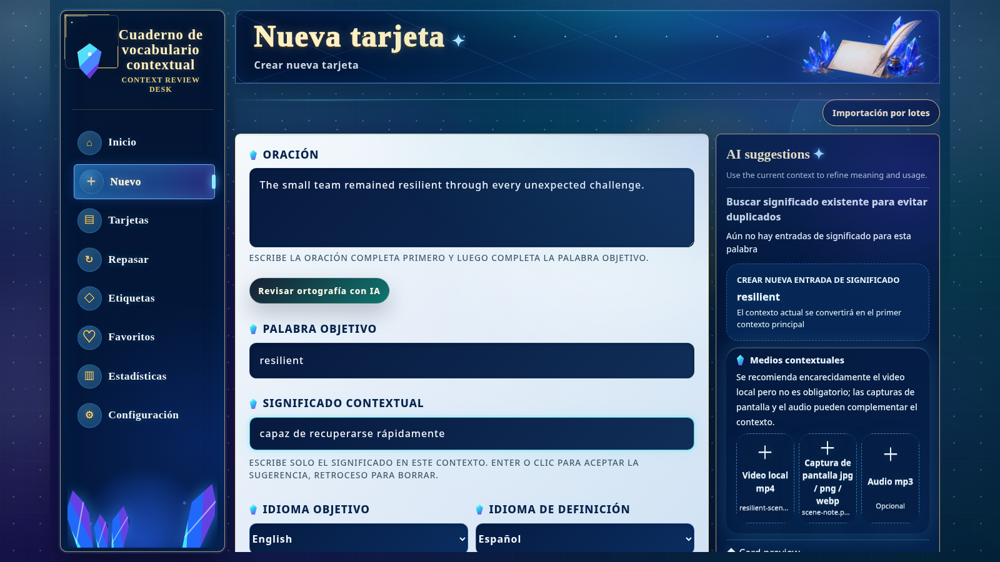

[English](./README.md) | [简体中文](./README.zh-CN.md) | [日本語](./README.ja.md) | [Español](./README.es.md) | [العربية](./README.ar.md) | [Deutsch](./README.de.md) | [Français](./README.fr.md) | [Italiano](./README.it.md) | [한국어](./README.ko.md) | [Русский](./README.ru.md) | [Latina](./README.la.md)

# Context Vocabulary Notebook (cuaderno de vocabulario contextual)

Guarda una palabra junto a la frase, imagen, audio o vídeo donde realmente la encontraste.

<!-- README:OVERVIEW -->
## Aprende la palabra en su contexto real

Context Vocabulary Notebook es una aplicación autoalojada y local-first. Cada tarjeta reúne
la palabra, su significado en ese contexto, la frase original, etiquetas, notas y medios
opcionales. FSRS programa el repaso y respondes con `Again` o `Good`.

No es un diccionario precargado, un servicio de sincronización en la nube ni una aplicación
nativa de escritorio. Es una aplicación web local para el vocabulario que tú recopilas.

<!-- README:PREVIEW -->
## Vista previa



Más pantallas: [detalle](./docs/demo/screen-card-detail.jpg),
[repaso](./docs/demo/screen-review.jpg) y [estadísticas](./docs/demo/screen-statistics.jpg).

<!-- README:WORKFLOW -->
## Flujo de estudio

1. Anota la frase, la palabra y el significado contextual.
2. Adjunta un archivo `mp4`, `mp3`, `jpg`, `png` o `webp`.
3. Organiza con etiquetas, favoritos, notas, búsqueda y filtros.
4. Repasa con `Again / Good`; FSRS elige el próximo intervalo.
5. Consulta cantidad, precisión, distribución de etiquetas y tendencia.

La importación por lotes procesa varios **clips MP4 locales** y permite confirmar cada
resultado antes de guardarlo. No admite URL de sitios de vídeo.

<!-- README:FEATURES -->
## Funciones actuales

| Área | Capacidad |
|---|---|
| Tarjetas | Frase, significado, notas, etiquetas y varios ejemplos de contexto. |
| Medios | Archivos locales `mp4`, `mp3`, `jpg`, `png` y `webp`. |
| Repaso | FSRS, `Again / Good`, progreso diario y reproducción de medios. |
| Biblioteca | Búsqueda, filtros, favoritos, etiquetas, edición y estado dominado. |
| Estadísticas | Cantidad de repasos, precisión, totales mensuales, etiquetas y tendencias. |
| Portabilidad | ZIP para copia personal o para compartir tarjetas. |
| Repaso Android sin conexión | Un Android vinculado, réplica cifrada, sincronización LAN HTTPS o Tailscale e imágenes/audio sin conexión. |
| Reconocimiento | ffmpeg, Tesseract OCR y whisper.cpp STT opcionales. |
| IA | Sugerencias opcionales mediante una API OpenAI-compatible. |

<!-- README:QUICKSTART -->
## Inicio rápido

Necesitas Git, npm y Node.js `20.19+` o `22.12+` (se recomienda Node.js 22 LTS).

Ejecuta el instalador desde un directorio vacío. El proyecto se instala directamente
allí y no crea otra carpeta `context-vocabulary-notebook` dentro.

Linux, macOS o WSL:

```bash
curl --retry 5 --retry-delay 2 --retry-connrefused -fsSL https://raw.githubusercontent.com/yaqxuan/context-vocabulary-notebook/main/scripts/install.sh | bash
```

Windows PowerShell:

```powershell
irm https://raw.githubusercontent.com/yaqxuan/context-vocabulary-notebook/main/scripts/install.ps1 -ErrorAction Stop | iex
```

Inicia la aplicación:

```bash
npm run dev
```

Abre <http://localhost:5173>. Salud de la API:
<http://localhost:3107/api/health>. Crea primero una tarjeta manual y prueba el repaso.

<!-- README:OPTIONAL -->
## Reconocimiento e IA opcionales

ffmpeg extrae medios, Tesseract lee texto visible y whisper.cpp con un modelo Whisper
transcribe la voz. Debido al tamaño del modelo, esta instalación está separada de la principal.

```bash
curl --retry 5 --retry-delay 2 --retry-connrefused -fsSL https://raw.githubusercontent.com/yaqxuan/context-vocabulary-notebook/main/scripts/install-recognition.sh | CVN_TESSERACT_LANG=spa bash
```

```powershell
$env:CVN_TESSERACT_LANG='spa'; irm https://raw.githubusercontent.com/yaqxuan/context-vocabulary-notebook/main/scripts/install-recognition-windows.ps1 -ErrorAction Stop | iex
```

La IA usa una API OpenAI-compatible configurada por ti. Crear tarjetas manualmente y repasar
no requiere OCR, STT ni IA.

<!-- README:PRIVACY -->
## Privacidad y datos

Por defecto, todo permanece en la carpeta de instalación:

```text
data/context-vocabulary-notebook.sqlite
uploads/
.env
```

No existe sincronización en la nube integrada. El trabajo manual y OCR/STT local conservan el
contenido en tu equipo. Un proveedor de IA de red configurado recibe texto para sugerencias y
audio para la transcripción de tarjetas. Solo con `CVN_CLIP_ANALYSIS_CLOUD_FALLBACK=1` se
pueden enviar fotogramas o audio tras fallar el reconocimiento local. La clave API queda local
y se excluye de las exportaciones ZIP de la aplicación.

<!-- README:DOCS -->
## Documentación

- [Guía completa en inglés](./docs/USER_GUIDE.md)
- [Guía completa en chino](./docs/USER_GUIDE.zh-CN.md)
- [Cómo contribuir](./CONTRIBUTING.md)
- [Política de seguridad](./SECURITY.md)
- [Código de conducta](./CODE_OF_CONDUCT.md)

La guía completa cubre actualizaciones, Windows/WSL, OCR/STT, variables de entorno,
copias de seguridad, instalación manual y resolución de problemas.

<!-- README:STATUS -->
## Estado del proyecto

Es una versión preliminar temprana para uso local y autoalojado. Antes de cambios importantes,
respalda `data/`, `uploads/` y `.env`.

Idiomas actuales de la interfaz: inglés, chino simplificado, japonés, coreano, francés,
alemán, español y ruso.

<!-- README:CONTRIBUTING -->
## Contribuir

Se aceptan informes de errores, propuestas concretas, traducciones y PR probados. Lee
[CONTRIBUTING.md](./CONTRIBUTING.md) y no publiques vocabulario, medios, bases de datos o
claves API privadas.

<!-- README:LICENSE -->
## Licencia

[MIT](./LICENSE)
