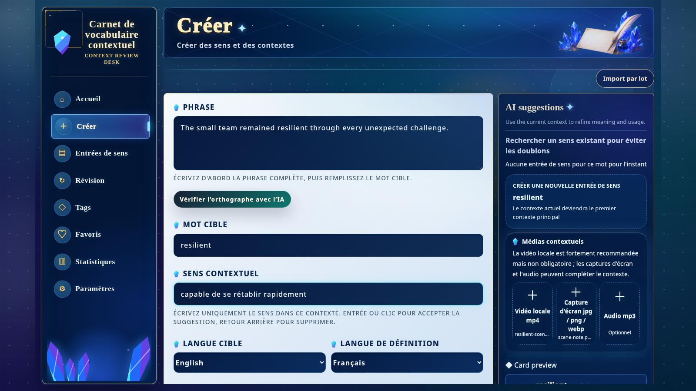

[English](./README.md) | [简体中文](./README.zh-CN.md) | [日本語](./README.ja.md) | [Español](./README.es.md) | [العربية](./README.ar.md) | [Deutsch](./README.de.md) | [Français](./README.fr.md) | [Italiano](./README.it.md) | [한국어](./README.ko.md) | [Русский](./README.ru.md) | [Latina](./README.la.md)

# Context Vocabulary Notebook (carnet de vocabulaire en contexte)

Conservez un mot avec la phrase, l’image, l’audio ou la vidéo où vous l’avez rencontré.

<!-- README:OVERVIEW -->
## Apprendre dans le contexte réel

Context Vocabulary Notebook est une application auto-hébergée et locale par défaut. Une
carte réunit le mot, son sens dans le contexte, la phrase originale, les étiquettes, les notes
et les médias facultatifs. FSRS planifie les révisions, évaluées par `Again` ou `Good`.

Ce n’est ni un dictionnaire prérempli, ni un service de synchronisation cloud, ni une
application de bureau native. C’est une application Web locale pour votre propre vocabulaire.

<!-- README:PREVIEW -->
## Aperçu



Autres écrans : [détail](./docs/demo/screen-card-detail.jpg),
[révision](./docs/demo/screen-review.jpg), [statistiques](./docs/demo/screen-statistics.jpg).

<!-- README:WORKFLOW -->
## Parcours d’apprentissage

1. Saisissez la phrase, le mot cible et son sens contextuel.
2. Joignez un fichier `mp4`, `mp3`, `jpg`, `png` ou `webp`.
3. Organisez avec étiquettes, favoris, notes, recherche et filtres.
4. Révisez avec `Again / Good` ; FSRS choisit le prochain intervalle.
5. Consultez volume, exactitude, distribution des étiquettes et évaluations.

L’importation par lot traite plusieurs **clips MP4 locaux** et permet de confirmer chaque
résultat avant l’enregistrement. Les URL de sites vidéo ne sont pas acceptées.

<!-- README:FEATURES -->
## Fonctions actuelles

| Domaine | Fonction |
|---|---|
| Cartes | Phrase, sens, notes, étiquettes et plusieurs exemples de contexte. |
| Médias | Fichiers locaux `mp4`, `mp3`, `jpg`, `png`, `webp`. |
| Révision | FSRS, `Again / Good`, progression quotidienne, lecture des médias. |
| Bibliothèque | Recherche, filtres, favoris, étiquettes, édition, état maîtrisé. |
| Statistiques | Nombre de révisions, précision, totaux mensuels, étiquettes et tendances. |
| Portabilité | ZIP de sauvegarde personnelle ou de cartes partageables. |
| Reconnaissance | ffmpeg, Tesseract OCR et whisper.cpp STT facultatifs. |
| IA | Suggestions facultatives via une API OpenAI-compatible. |

<!-- README:QUICKSTART -->
## Démarrage rapide

Requiert Git, npm et Node.js `20.19+` ou `22.12+` (Node.js 22 LTS recommandé).

Exécutez l’installateur depuis un dossier vide. Le projet est installé directement
dans ce dossier, sans créer un sous-dossier `context-vocabulary-notebook`.

Linux, macOS ou WSL :

```bash
curl --retry 5 --retry-delay 2 --retry-connrefused -fsSL https://raw.githubusercontent.com/yaqxuan/context-vocabulary-notebook/main/scripts/install.sh | bash
```

Windows PowerShell :

```powershell
irm https://raw.githubusercontent.com/yaqxuan/context-vocabulary-notebook/main/scripts/install.ps1 -ErrorAction Stop | iex
```

Démarrer :

```bash
npm run dev
```

Ouvrez <http://localhost:5173>. État de l’API :
<http://localhost:3107/api/health>. Créez d’abord une carte manuellement.

<!-- README:OPTIONAL -->
## Reconnaissance et IA facultatives

ffmpeg extrait les médias, Tesseract lit le texte visible et whisper.cpp avec un modèle
Whisper transcrit la parole. La reconnaissance est installée séparément à cause du modèle.

```bash
curl --retry 5 --retry-delay 2 --retry-connrefused -fsSL https://raw.githubusercontent.com/yaqxuan/context-vocabulary-notebook/main/scripts/install-recognition.sh | CVN_TESSERACT_LANG=fra bash
```

```powershell
$env:CVN_TESSERACT_LANG='fra'; irm https://raw.githubusercontent.com/yaqxuan/context-vocabulary-notebook/main/scripts/install-recognition-windows.ps1 -ErrorAction Stop | iex
```

Les suggestions IA utilisent une API OpenAI-compatible configurée par vous. La création
manuelle et la révision ne dépendent ni d’OCR, ni de STT, ni d’IA.

<!-- README:PRIVACY -->
## Confidentialité et données

Par défaut, les données restent dans le dossier d’installation :

```text
data/context-vocabulary-notebook.sqlite
uploads/
.env
```

Il n’y a pas de synchronisation cloud intégrée. Le travail manuel et l’OCR/STT local gardent
le contenu sur votre machine. Un fournisseur IA réseau configuré reçoit le texte des suggestions
et l’audio des transcriptions de carte. Seulement avec `CVN_CLIP_ANALYSIS_CLOUD_FALLBACK=1`,
des images ou l’audio d’un clip peuvent être envoyés après un échec local. La clé API reste
locale et n’entre pas dans les exports ZIP de l’application.

<!-- README:DOCS -->
## Documentation

- [Guide complet en anglais](./docs/USER_GUIDE.md)
- [Guide complet en chinois](./docs/USER_GUIDE.zh-CN.md)
- [Contribuer](./CONTRIBUTING.md)
- [Politique de sécurité](./SECURITY.md)
- [Code de conduite](./CODE_OF_CONDUCT.md)

Les mises à jour, Windows/WSL, OCR/STT, variables d’environnement, sauvegardes et dépannages
sont détaillés dans le guide complet.

<!-- README:STATUS -->
## État du projet

Il s’agit d’une préversion pour un usage local auto-hébergé. Sauvegardez `data/`, `uploads/`
et `.env` avant les changements importants.

Langues actuelles de l’interface : anglais, chinois simplifié, japonais, coréen, français,
allemand, espagnol et russe.

<!-- README:CONTRIBUTING -->
## Contribuer

Les rapports de bogue, propositions ciblées, traductions et PR testées sont bienvenus. Lisez
[CONTRIBUTING.md](./CONTRIBUTING.md) et ne publiez ni vocabulaire privé, ni média, ni base,
ni clé API.

<!-- README:LICENSE -->
## Licence

[MIT](./LICENSE)
