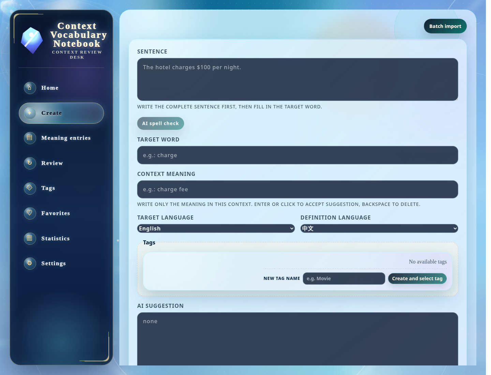

[中文](./README.md) | [English](./README.en.md) | [日本語](./README.ja.md) | [Español](./README.es.md) | [العربية](./README.ar.md) | [Deutsch](./README.de.md) | [Français](./README.fr.md) | [Italiano](./README.it.md) | [Latina](./README.la.md)

# Context Vocabulary Notebook (quaderno di vocaboli contestuali)

Quando incontri una parola nuova guardando video, ascoltando corsi o leggendo sottotitoli, l’app salva non solo “la parola”, ma anche la frase originale, il contesto, lo screenshot, il clip audio/video, note e tag.

Durante il ripasso vedi la scena reale in cui hai incontrato la parola, non un termine isolato.

Fa per te se:

- Guardi spesso video, corsi, film, podcast o materiali di ascolto in lingua straniera.
- Vuoi una ripetizione dilazionata simile ad Anki, ma con schede che conservano la frase originale, gli screenshot e i clip multimediali.
- Vuoi mantenere i dati di studio sul tuo computer, senza registrare un account cloud solo per un quaderno di vocaboli.
- Hai bisogno di aiuto per riconoscere frasi da video, audio o immagini locali prima di rifinirle manualmente in schede.

> Questo progetto è una web app locale. Per impostazione predefinita, i dati sono salvati in un database SQLite e nella cartella `uploads/` sul tuo computer; non è richiesto alcun account cloud.

## Demo



## Cosa puoi farci

- Crea schede attorno a un contesto reale: parola target, frase originale, significato contestuale, note e tag.
- Salva allegati multimediali locali: video `mp4`, audio `mp3`, immagini `jpg / png / webp`.
- Importa clip in batch: importa più clip video, audio o immagine insieme, controlla i risultati di riconoscimento uno per uno e crea schede.
- Usa assistenti locali opzionali OCR/STT: configura ffmpeg, Tesseract e whisper.cpp per riconoscere frasi da immagini, fotogrammi video o audio.
- Collega più esempi di contesto allo stesso significato di una parola, utile per vedere come un significato appare in materiali diversi.
- Ripassa con ripetizione dilazionata FSRS, riportando ogni parola nel contesto in cui l’hai trovata.
- Cerca, filtra per tag, aggiungi ai preferiti, visualizza statistiche e importa/esporta backup ZIP.
- Suggerimenti IA opzionali: dopo aver configurato una API OpenAI-compatible, ricevi aiuto per significati contestuali, note d’uso, traduzione di frasi intere, lemmatizzazione e controllo ortografico.

## Posizione dei dati e spazio su disco

Scegli prima la directory di installazione. Per impostazione predefinita, l’app conserva database, file caricati e configurazione nella directory da cui viene eseguita.

Dati locali predefiniti:

```text
data/context-vocabulary-notebook.sqlite
uploads/
.env
```

Nota: dopo aver caricato video, audio e screenshot, `uploads/` può continuare a crescere. Anche i modelli Whisper possono occupare da centinaia di MB a diversi GB.

Evita di eseguirla in queste posizioni:

- `/usr/local`, `/opt` o altre directory che di solito richiedono permessi `sudo` o root.
- `C:\Program Files` o altre directory protette dal sistema.
- Cartelle temporanee, cache dei download o posizioni che il sistema o strumenti di pulizia potrebbero eliminare automaticamente.
- Posizioni con poco spazio libero, regole di sincronizzazione poco chiare o comportamento di pulizia/quota di unità cloud.

Preferisci un luogo che puoi mantenere a lungo termine, ad esempio:

```text
D:\study\context-vocabulary-notebook
E:\study\context
$HOME/context-vocabulary-notebook
```

## Installazione con un comando

Entra in una directory vuota in cui vuoi conservare i file del progetto, poi esegui il comando per il tuo sistema. Lo script installa il progetto nella directory corrente; se la directory contiene già questo progetto, lo aggiorna automaticamente.

| Sistema | Comando |
|------|------|
| Linux / macOS / WSL | Vedi il comando Linux / macOS / WSL qui sotto |
| Windows PowerShell | Vedi il comando Windows PowerShell qui sotto |

### Linux / macOS / WSL

```bash
curl --retry 5 --retry-delay 2 --retry-connrefused -fsSL https://raw.githubusercontent.com/yaqxuan/context-vocabulary-notebook/main/scripts/install.sh | bash
```

### Windows PowerShell

```powershell
irm https://raw.githubusercontent.com/yaqxuan/context-vocabulary-notebook/main/scripts/install.ps1 -ErrorAction Stop | iex
```

Dopo l’installazione, avvialo con:

```bash
npm run dev
```

Aprilo nel browser:

```text
http://localhost:5173
```

Controllo di integrità del backend:

```text
http://localhost:3107/api/health
```

## Aggiornare all’ultima versione

Entra nella directory in cui hai installato il progetto, poi esegui:

Linux / macOS / WSL / Git Bash:

```bash
git pull --ff-only
npm ci
npm run build
npm run dev
```

Windows PowerShell:

```powershell
git pull --ff-only
npm ci
npm run build
npm run dev
```

Puoi anche rieseguire il comando di installazione con un clic. Se lo script rileva che la directory corrente è già questo progetto, aggiorna, installa le dipendenze e compila automaticamente.

## OCR / riconoscimento vocale locale (opzionale)

Il quaderno principale non richiede OCR/STT. Puoi prima creare schede e ripassare manualmente; configura questi strumenti solo quando devi riconoscere automaticamente frasi originali da video, audio o immagini.

Il riconoscimento locale usa:

- ffmpeg: estrae audio dai video.
- Tesseract: riconosce testo in immagini o fotogrammi video.
- whisper.cpp + modello Whisper: riconosce il parlato in audio o video.

### Configurare automaticamente il riconoscimento locale (primo tentativo consigliato)

Esegui questo nella directory del progetto:

Linux / macOS / WSL:

```bash
curl --retry 5 --retry-delay 2 --retry-connrefused -fsSL https://raw.githubusercontent.com/yaqxuan/context-vocabulary-notebook/main/scripts/install-recognition.sh | bash
```

Windows PowerShell:

```powershell
$env:CVN_TESSERACT_LANG='eng'; irm https://raw.githubusercontent.com/yaqxuan/context-vocabulary-notebook/main/scripts/install-recognition-windows.ps1 -ErrorAction Stop | iex
```

Per riconoscere sottotitoli in cinese e inglese, cambia la lingua in:

```powershell
$env:CVN_TESSERACT_LANG='eng+chi_sim'; irm https://raw.githubusercontent.com/yaqxuan/context-vocabulary-notebook/main/scripts/install-recognition-windows.ps1 -ErrorAction Stop | iex
```

Al termine dello script, fai clic su **I installed it, check again** nella scheda di riconoscimento locale nella pagina delle impostazioni dell’app. Le versioni recenti ricaricano `.env`, quindi di solito non serve riavviare manualmente il backend.

### Modelli e uso del disco

I modelli Whisper sono grandi e il tempo di download dipende dalla rete:

- `tiny` / `base`: piccoli e veloci, adatti per provare, con precisione inferiore.
- `small` / `medium`: precisione migliore, con maggiore uso di disco e CPU.
- `large`: molto grande e può essere lento su computer comuni; non è consigliato come scelta predefinita.

L’installer di riconoscimento per Windows scarica `ggml-small.bin` per impostazione predefinita, circa diverse centinaia di MB.

### Configurare manualmente il riconoscimento locale

Se la configurazione con un clic fallisce, o se vuoi gestire tu i percorsi degli strumenti, installa manualmente gli strumenti e scrivi questi valori in `.env`:

```env
CVN_FFMPEG_PATH=/absolute/path/to/ffmpeg

CVN_STT_PROVIDER=whisper.cpp
CVN_WHISPER_CPP_PATH=/absolute/path/to/whisper-cli
CVN_WHISPER_CPP_MODEL=/absolute/path/to/ggml-small.bin
CVN_WHISPER_CPP_TIMEOUT_MS=120000

CVN_OCR_PROVIDER=tesseract
CVN_TESSERACT_PATH=/absolute/path/to/tesseract
CVN_TESSERACT_LANG=eng
CVN_TESSERACT_TIMEOUT_MS=30000
```

Esempio di percorso Windows:

```env
CVN_FFMPEG_PATH=E:\study\context\tools\ffmpeg\bin\ffmpeg.exe
CVN_WHISPER_CPP_PATH=E:\study\context\tools\whisper.cpp\Release\whisper-cli.exe
CVN_WHISPER_CPP_MODEL=E:\study\context\models\ggml-small.bin
CVN_TESSERACT_PATH=E:\study\context\tools\tesseract\tesseract.exe
CVN_TESSERACT_LANG=eng+chi_sim
```


## Opzioni di installazione avanzate

### Specificare la directory di installazione

Linux / macOS / WSL:

```bash
export CVN_HOME="$HOME/context-vocabulary-notebook"
curl --retry 5 --retry-delay 2 --retry-connrefused -fsSL https://raw.githubusercontent.com/yaqxuan/context-vocabulary-notebook/main/scripts/install.sh | bash
```

Windows PowerShell:

```powershell
$env:CVN_HOME = "C:\path\to\empty-folder"
irm https://raw.githubusercontent.com/yaqxuan/context-vocabulary-notebook/main/scripts/install.ps1 -ErrorAction Stop | iex
```

### Lasciare che l’installer principale aggiunga strumenti opzionali

Non sono necessari per una normale prima installazione. Usali solo quando servono.

Linux / macOS / WSL:

```bash
export CVN_INSTALL_FFMPEG=1
export CVN_INSTALL_TESSERACT=1
curl --retry 5 --retry-delay 2 --retry-connrefused -fsSL https://raw.githubusercontent.com/yaqxuan/context-vocabulary-notebook/main/scripts/install.sh | bash
```

Windows PowerShell:

```powershell
$env:CVN_INSTALL_FFMPEG = "1"
$env:CVN_INSTALL_TESSERACT = "1"
irm https://raw.githubusercontent.com/yaqxuan/context-vocabulary-notebook/main/scripts/install.ps1 -ErrorAction Stop | iex
```

Sorgente dell’installer:

- Linux / macOS / WSL: https://github.com/yaqxuan/context-vocabulary-notebook/blob/main/scripts/install.sh
- Windows PowerShell: https://github.com/yaqxuan/context-vocabulary-notebook/blob/main/scripts/install.ps1

## Installazione manuale

Se gli script con un clic non riescono a preparare l’ambiente, installa prima manualmente Node.js 22 LTS, npm, Git e gli strumenti nativi di compilazione necessari, poi esegui:

Linux / macOS / WSL / Git Bash:

```bash
cd "$HOME"
git clone https://github.com/yaqxuan/context-vocabulary-notebook.git context-vocabulary-notebook
cd context-vocabulary-notebook
cp .env.example .env
npm ci
npm run dev
```

Windows PowerShell:

```powershell
Set-Location $HOME
git clone https://github.com/yaqxuan/context-vocabulary-notebook.git context-vocabulary-notebook
Set-Location context-vocabulary-notebook
Copy-Item .env.example .env
npm ci
npm run dev
```

Aprilo nel browser:

```text
http://localhost:5173
```

## Domande frequenti

### Cosa fare se l’installazione con un comando fallisce?

- If the message says a command is missing, close and reopen the terminal, then run the installer again.
- Linux / WSL: if `apt-get update` reports Docker, Chromium, Snap, GPG key, or similar errors, it is usually an existing apt-source or unfinished package-configuration issue, not because this project depends on those packages. Fix/disable the affected apt source first, or manually install Git, Node.js 22 LTS, and npm before retrying.
- macOS: if the Xcode Command Line Tools prompt appears, click Install, then rerun the installer after it completes.
- Windows: if `npm ci` fails at `better-sqlite3`, you usually need Python and Visual Studio Build Tools / MSVC; if you are not familiar with these tools, WSL is recommended.

### La pagina si apre, ma il riconoscimento locale risulta ancora non configurato

First make sure the recognition installer has completed and the corresponding `CVN_*` paths exist in `.env`. Then click **I installed it, check again** on the settings page.

If it still does not work:

- Make sure the app was started from the same project directory.
- Make sure no old `3107` backend process is occupying the port.
- Run `npm run dev` again and refresh the page.

### La porta è già in uso

Change the backend port:

```env
PORT=3108
```

Linux / macOS / WSL / Git Bash change the frontend port:

```bash
CLIENT_PORT=5174 npm run dev
```

Windows PowerShell change the frontend port:

```powershell
$env:CLIENT_PORT = "5174"
npm run dev
```

### La clip non ha sottotitoli visibili, quindi non viene riconosciuta la frase originale

Se il fotogramma del video non contiene sottotitoli, o se i sottotitoli sono minuscoli/sfocati, OCR potrebbe non trovare una frase; in quel caso serve il riconoscimento vocale. Verifica che ffmpeg, whisper.cpp e `CVN_WHISPER_CPP_MODEL` siano disponibili. Se anche l’audio non contiene parlato chiaro, inserisci manualmente la frase originale.

Se compare `Audio extraction failed`, di solito ffmpeg non è disponibile, il percorso è errato oppure ffmpeg non riesce a leggere il file video/audio di origine.

### Dati lingua Tesseract mancanti

If OCR reports missing language data, Tesseract was found but the matching traineddata is not installed. Common language codes:

- English: `eng`
- Simplified Chinese: `chi_sim`
- Japanese: `jpn`
- Korean: `kor`
- French: `fra`
- German: `deu`
- Spanish: `spa`
- Russian: `rus`

For multiple languages:

```env
CVN_TESSERACT_LANG=eng+chi_sim
```

### Il percorso del modello Whisper non è configurato

`CVN_WHISPER_CPP_MODEL` non ha un modello predefinito. Scarica un modello ggml supportato da whisper.cpp e scrivi il suo percorso assoluto in `.env`.

## Dati e backup

By default, all data is under the project directory:

```text
data/context-vocabulary-notebook.sqlite
uploads/
.env
```

For backup, save them together:

```bash
tar -czf vocabulary-notebook-backup.tar.gz data uploads .env
```

To restore, put these files back into the same project directory and start the app.

The app also provides ZIP import/export:

- Full backup: includes cards, contexts, media, tags, favorites, review state, FSRS state, review logs, and user settings.
- Card-only sharing: excludes personal review progress, favorite state, and user settings.

AI API Keys are local sensitive configuration and are not included in exports; you need to enter them again on another device.

## Consigli per i file multimediali

| Type | Supported formats | Recommended size |
|------|----------|----------|
| Video | `mp4` | within 300MB per file |
| Audio | `mp3` | within 50MB per file |
| Image | `jpg` / `png` / `webp` | within 10MB per file |

## Configurazione dei suggerimenti AI

The card creation page supports optional AI suggestions. Add an OpenAI-compatible API configuration on the settings page:

- Display name
- Base URL
- API Key
- Model

Notes:

- Without AI configuration, manual card creation and review still work normally.
- The API Key is stored in the local database and masked in the UI.
- The API Key is not included in export files.
- AI can suggest contextual meanings, usage notes, full-sentence translations, lemmatization, and spell checks during card creation.
- OpenAI-compatible text models such as DeepSeek do not perform local OCR/STT; image text recognition depends on Tesseract, and speech recognition depends on whisper.cpp.

## Requisiti

| Environment | Requirement | Notes |
|------|------|------|
| Node.js | Node.js 22 LTS recommended | Frontend build, development servers, and backend service all depend on Node.js. The installer tries to provide it. |
| npm | Installed with Node.js | The repository includes `package-lock.json`; dependencies are installed with `npm ci`. |
| Git | Required when cloning from GitHub | The installer checks for it and tries to provide it. |
| Browser | Chrome / Edge / Firefox / Safari or another modern browser | The app is used through a local web page. |
| C/C++ build tools | May be required | `better-sqlite3` is a native module; if no prebuilt package is available, `npm ci` tries to compile it locally. |
| ffmpeg | Optional | Required for video/audio clip analysis. |
| Tesseract OCR | Optional | Required for OCR on images or video frames. |
| whisper.cpp + Whisper model | Optional | Required for speech recognition on audio/video. |

### Raccomandazione WSL / Windows nativo

- WSL is usually the most stable: Node, Git, ffmpeg, Tesseract, and native build tools are closer to Linux paths.
- Native Windows PowerShell is supported: the script reuses existing Git / Node.js / npm and tries `winget` only when something is missing.
- If native Windows `npm ci` fails at `better-sqlite3`, install Python and Visual Studio Build Tools / MSVC as prompted, or use WSL.

## Variabili d’ambiente

<!-- AUTO-GENERATED:ENV -->
| Variable | Required | Default | Description |
|------|------|--------|------|
| `PORT` | Non richiesto | `3107` | Porta del servizio backend Express. Il server di sviluppo Vite inoltra `/api` a questa porta. |
| `DATABASE_PATH` | Non richiesto | `./data/context-vocabulary-notebook.sqlite` | Percorso del database SQLite. I percorsi relativi sono risolti dalla radice del progetto. |
| `UPLOADS_DIR` | Non richiesto | `./uploads` | Directory per i file multimediali caricati. I percorsi relativi sono risolti dalla radice del progetto. |
| `CVN_FFMPEG_PATH` | Non richiesto | `ffmpeg` | Percorso dell’eseguibile ffmpeg; nelle installazioni di strumenti Windows nativi, usa un percorso assoluto se necessario. |
| `CVN_STT_PROVIDER` | Non richiesto | `whisper.cpp` | Provider locale di riconoscimento vocale; può essere `whisper.cpp` o `disabled`. |
| `CVN_WHISPER_CPP_PATH` | Non richiesto | `whisper-cli` | Percorso dell’eseguibile whisper.cpp; se il sistema ha solo il vecchio `main`, imposta `main` o un percorso assoluto. |
| `CVN_WHISPER_CPP_MODEL` | Richiesto per STT locale | Vuoto | Percorso del file modello Whisper; l’installer non scarica automaticamente un modello. |
| `CVN_WHISPER_CPP_TIMEOUT_MS` | Non richiesto | `120000` | Timeout per una singola esecuzione di riconoscimento whisper.cpp. |
| `CVN_OCR_PROVIDER` | Non richiesto | `tesseract` | Provider OCR locale; può essere `tesseract` o `disabled`. |
| `CVN_TESSERACT_PATH` | Non richiesto | `tesseract` | Percorso dell’eseguibile Tesseract. |
| `CVN_TESSERACT_LANG` | Non richiesto | Scelto automaticamente in base alla lingua target | Codici lingua Tesseract, come `eng`, `chi_sim`, `eng+chi_sim`. |
| `CVN_TESSERACT_TIMEOUT_MS` | Non richiesto | `30000` | Timeout per una singola esecuzione OCR Tesseract. |
| `CVN_CLIP_ANALYSIS_CLOUD_FALLBACK` | Non richiesto | `0` | Consente la trascrizione cloud di fallback quando il riconoscimento locale dei clip fallisce; disattivato per impostazione predefinita. |
| `CVN_LOCAL_READINESS_TIMEOUT_MS` | Non richiesto | Deciso dal server | Timeout per i controlli di disponibilità del riconoscimento locale. |
<!-- /AUTO-GENERATED:ENV -->

## Comandi comuni

<!-- AUTO-GENERATED:SCRIPTS -->
| Command | Description |
|------|------|
| `npm run dev` | Start both the backend development server and the Vite frontend development server. |
| `npm run dev:client` | Start only the Vite frontend development server, listening on `0.0.0.0:5173` by default. |
| `npm run dev:server` | Start only the backend Express development server, listening on `localhost:3107` by default. |
| `npm run build` | Run type checks, then build the frontend and backend. |
| `npm test` | Run Vitest unit / integration tests. |
| `npm run test:e2e` | Run Playwright E2E tests; passes even when there are no test files. |
| `npm run typecheck` | Run TypeScript type checks for the frontend and Node side. |
| `npm run lint` | Currently equivalent to `npm run typecheck`. |
<!-- /AUTO-GENERATED:SCRIPTS -->

## Note di sviluppo

Project stack:

- React + Vite
- Node.js + Express
- SQLite + better-sqlite3
- ts-fsrs
- Tailwind CSS
- Vitest
- Playwright

La versione 1 resta local-first: nessun dizionario integrato, nessuna integrazione con dizionari, nessun link a video di siti web e nessuna sincronizzazione. L’attuale V2 aggiunge suggerimenti AI durante la creazione delle schede e strumenti locali di riconoscimento dei clip.

## Note prima dell’installazione e disclaimer

Per quanto l’autore ne sappia attualmente, il codice sorgente proprio di questo progetto non contiene codice dannoso. L’installer controlla l’ambiente locale e, sulle piattaforme supportate, tenta di installare dipendenze mancanti come Git, Node.js e npm; quando mancano strumenti di build nativi, stampa indicazioni, e alcune piattaforme richiedono l’installazione manuale.

L’installazione scarica software e dipendenze di terze parti tramite i gestori di pacchetti del sistema e npm. Installazione e uso possono comunque essere influenzati da permessi di sistema, condizioni di rete, disponibilità del gestore di pacchetti, software antivirus, policy dei dispositivi aziendali, spazio su disco, catene di fornitura delle dipendenze di terze parti, risultati della compilazione dei moduli nativi Node e fattori simili. Problemi e conseguenze causati dall’esecuzione degli installer, dall’installazione delle dipendenze, dalla modifica dell’ambiente di sistema e dal caricamento/salvataggio di file locali sono responsabilità dell’utente.

Se lo script non riesce a preparare automaticamente l’ambiente, stampa gli strumenti mancanti e i passaggi successivi suggeriti; quindi devi installarli manualmente per il tuo sistema e riprovare.

## Licenza

Questo progetto usa la MIT License. Vedi [`LICENSE`](./LICENSE).
