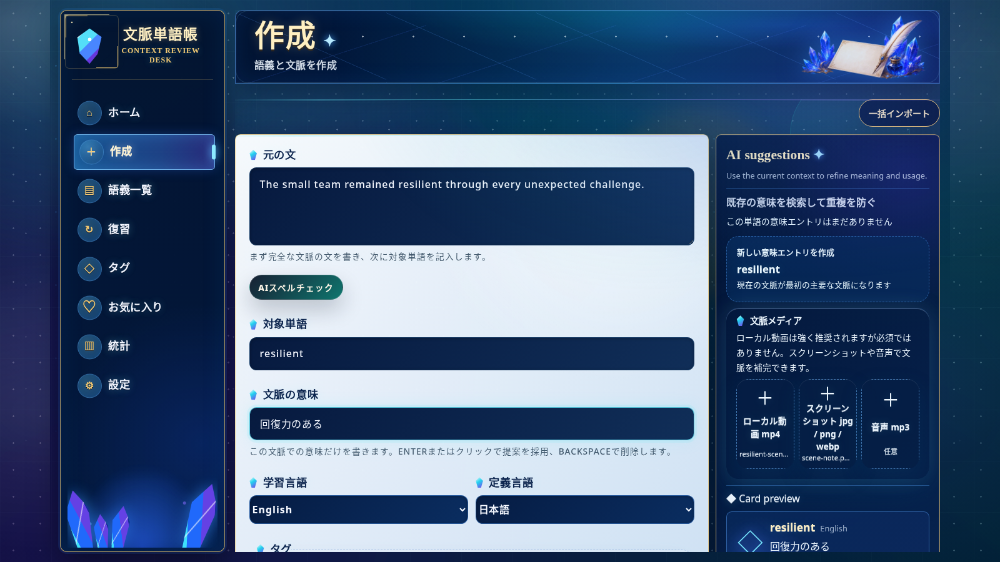

[English](./README.md) | [简体中文](./README.zh-CN.md) | [日本語](./README.ja.md) | [Español](./README.es.md) | [العربية](./README.ar.md) | [Deutsch](./README.de.md) | [Français](./README.fr.md) | [Italiano](./README.it.md) | [한국어](./README.ko.md) | [Русский](./README.ru.md) | [Latina](./README.la.md)

# Context Vocabulary Notebook（文脈単語帳）

単語に出会った実際の文、画像、音声、動画を一緒に保存し、自分だけの語彙帳を作ります。

<!-- README:OVERVIEW -->
## 実際の文脈で覚える

Context Vocabulary Notebook は、セルフホスト型・ローカルファーストの学習アプリです。
カードには対象語、現在の文脈での意味、原文、タグ、メモ、任意のメディアを保存します。
FSRS が復習を予定し、学習者は `Again` または `Good` で答えます。

既製の辞書、クラウド同期サービス、ネイティブデスクトップアプリではありません。
自分で集めた語彙をブラウザーで学ぶローカル Web アプリです。

<!-- README:PREVIEW -->
## 画面



ほかの画面： [カード詳細](./docs/demo/screen-card-detail.jpg)、
[復習](./docs/demo/screen-review.jpg)、[統計](./docs/demo/screen-statistics.jpg)。

<!-- README:WORKFLOW -->
## 学習の流れ

1. 出会った原文、対象語、文脈上の意味を記録します。
2. `mp4`、`mp3`、`jpg`、`png`、`webp` の文脈資料を添付します。
3. タグ、お気に入り、メモ、検索、状態フィルターで整理します。
4. `Again / Good` で復習し、FSRS に次の間隔を任せます。
5. 復習数、正答率、タグ分布、評価推移を振り返ります。

一括インポートは複数の**ローカル MP4 クリップ**を処理し、各カードを保存する前に
認識結果を確認できます。動画サイトの URL は受け付けません。

<!-- README:FEATURES -->
## 現在の機能

| 領域 | 機能 |
|---|---|
| 文脈カード | 原文、文脈上の意味、メモ、タグ、複数の文脈例。 |
| メディア | ローカルの `mp4`、`mp3`、`jpg`、`png`、`webp`。 |
| 復習 | FSRS、`Again / Good`、毎日の進捗、メディア再生。 |
| ライブラリ | 検索、絞り込み、お気に入り、タグ、編集、習得済み状態。 |
| 統計 | 復習回数、正答率、月別集計、タグ、評価傾向。 |
| 移行 | 個人バックアップまたは共有カード用 ZIP。 |
| Android オフライン復習 | 1 台の Android、暗号化ローカル複製、LAN HTTPS / Tailscale 同期、画像・音声のオフライン復習。 |
| ローカル認識 | 任意の ffmpeg、Tesseract OCR、whisper.cpp STT。 |
| AI | 任意の OpenAI-compatible な意味・用法・翻訳・語形・綴り提案。 |

<!-- README:QUICKSTART -->
## クイックスタート

Git、npm、Node.js `20.19+` または `22.12+` が必要です（Node.js 22 LTS 推奨）。

空のインストール先ディレクトリへ移動してから実行してください。プロジェクトは現在の
ディレクトリへ直接インストールされ、入れ子の `context-vocabulary-notebook` は作成されません。

Linux、macOS、WSL：

```bash
curl --retry 5 --retry-delay 2 --retry-connrefused -fsSL https://raw.githubusercontent.com/yaqxuan/context-vocabulary-notebook/main/scripts/install.sh | bash
```

Windows PowerShell：

```powershell
irm https://raw.githubusercontent.com/yaqxuan/context-vocabulary-notebook/main/scripts/install.ps1 -ErrorAction Stop | iex
```

起動：

```bash
npm run dev
```

<http://localhost:5173> を開きます。API の確認先は
<http://localhost:3107/api/health> です。まずカードを 1 枚手動で作り、復習を試してください。

<!-- README:OPTIONAL -->
## 任意の認識機能と AI

ローカル認識では ffmpeg がメディアを抽出し、Tesseract が画面文字を読み、
whisper.cpp と Whisper モデルが音声を文字にします。モデルが大きいため、認識の設定は
コアアプリのインストールとは別です。

```bash
curl --retry 5 --retry-delay 2 --retry-connrefused -fsSL https://raw.githubusercontent.com/yaqxuan/context-vocabulary-notebook/main/scripts/install-recognition.sh | CVN_TESSERACT_LANG=jpn bash
```

```powershell
$env:CVN_TESSERACT_LANG='jpn'; irm https://raw.githubusercontent.com/yaqxuan/context-vocabulary-notebook/main/scripts/install-recognition-windows.ps1 -ErrorAction Stop | iex
```

AI は自分で設定した OpenAI-compatible API を利用します。手動カード作成と復習には、
OCR、STT、AI のどれも必須ではありません。

<!-- README:PRIVACY -->
## プライバシーとデータ

既定ではデータはインストール先に残ります。

```text
data/context-vocabulary-notebook.sqlite
uploads/
.env
```

組み込みのクラウド同期はありません。手動操作とローカル OCR/STT は内容を端末内に
保持します。ネットワーク AI を設定すると、AI 提案ではテキスト、カードの文字起こしでは
音声が送信されます。`CVN_CLIP_ANALYSIS_CLOUD_FALLBACK=1` の場合に限り、ローカル認識の
失敗後に動画フレームまたは音声が送信されることがあります。API キーはアプリ内 ZIP
エクスポートには含まれません。

<!-- README:DOCS -->
## ドキュメント

- [完全な英語ユーザーガイド](./docs/USER_GUIDE.md)
- [完全な中国語ユーザーガイド](./docs/USER_GUIDE.zh-CN.md)
- [コントリビューションガイド](./CONTRIBUTING.md)
- [セキュリティーポリシー](./SECURITY.md)
- [行動規範](./CODE_OF_CONDUCT.md)

詳細な更新、Windows/WSL、OCR/STT、環境変数、バックアップ、トラブルシューティングは
ユーザーガイドにまとめています。

<!-- README:STATUS -->
## プロジェクトの状態

現在はローカル・セルフホスト用途の早期プレリリースです。大きな変更や更新の前に
`data/`、`uploads/`、`.env` をバックアップしてください。

現在の UI 言語：英語、簡体字中国語、日本語、韓国語、フランス語、ドイツ語、
スペイン語、ロシア語。

<!-- README:CONTRIBUTING -->
## 貢献

バグ報告、焦点を絞った提案、翻訳、テスト済み PR を歓迎します。
[CONTRIBUTING.md](./CONTRIBUTING.md) を読み、個人の語彙・メディア・DB・API キーを
報告に含めないでください。

<!-- README:LICENSE -->
## ライセンス

[MIT](./LICENSE)
