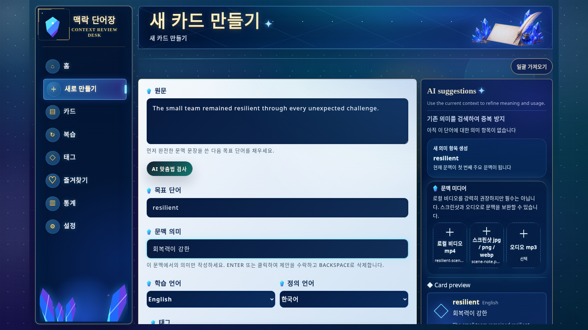

[English](./README.md) | [简体中文](./README.zh-CN.md) | [日本語](./README.ja.md) | [Español](./README.es.md) | [العربية](./README.ar.md) | [Deutsch](./README.de.md) | [Français](./README.fr.md) | [Italiano](./README.it.md) | [한국어](./README.ko.md) | [Русский](./README.ru.md) | [Latina](./README.la.md)

# Context Vocabulary Notebook (문맥 단어장)

단어를 실제로 만난 문장, 이미지, 오디오, 동영상을 함께 저장해 나만의 어휘 라이브러리를 만드세요.

<!-- README:OVERVIEW -->
## 실제 문맥에서 단어를 기억하세요

Context Vocabulary Notebook은 셀프 호스팅 방식의 로컬 우선 학습 앱입니다. 카드 하나에
목표 단어, 현재 문맥에서의 뜻, 원문, 태그, 메모, 선택적 미디어를 함께 보관합니다.
FSRS가 복습을 예약하고 사용자는 `Again` 또는 `Good`으로 답합니다.

기본 제공 사전, 클라우드 동기화 서비스, 네이티브 데스크톱 프로그램이 아닙니다.
직접 수집한 어휘를 브라우저에서 학습하는 로컬 웹 앱입니다.

<!-- README:PREVIEW -->
## 화면 미리보기



다른 화면: [카드 상세](./docs/demo/screen-card-detail.jpg),
[복습](./docs/demo/screen-review.jpg), [통계](./docs/demo/screen-statistics.jpg).

<!-- README:WORKFLOW -->
## 학습 흐름

1. 만난 원문, 목표 단어, 문맥 속 뜻을 기록합니다.
2. `mp4`, `mp3`, `jpg`, `png`, `webp` 문맥 자료를 첨부합니다.
3. 태그, 즐겨찾기, 메모, 검색, 상태 필터로 정리합니다.
4. `Again / Good`으로 복습하면 FSRS가 다음 간격을 정합니다.
5. 복습량, 정답률, 태그 분포, 평가 추세를 확인합니다.

일괄 가져오기는 여러 **로컬 MP4 클립**을 처리하고, 카드마다 인식 결과를 확인한 뒤
저장하게 합니다. 동영상 웹사이트 URL은 지원하지 않습니다.

<!-- README:FEATURES -->
## 현재 기능

| 영역 | 기능 |
|---|---|
| 문맥 카드 | 원문, 문맥 뜻, 메모, 태그, 여러 문맥 예시. |
| 미디어 | 로컬 `mp4`, `mp3`, `jpg`, `png`, `webp`. |
| 복습 | FSRS, `Again / Good`, 일일 진행률, 미디어 재생. |
| 라이브러리 | 검색, 필터, 즐겨찾기, 태그, 편집, 암기 완료 상태. |
| 통계 | 복습 횟수, 정확도, 월별 합계, 태그, 평가 추세. |
| 이동성 | 개인 백업 또는 카드 공유용 ZIP. |
| Android 오프라인 복습 | Android 한 대, 암호화된 로컬 복제본, LAN HTTPS 또는 Tailscale 동기화, 이미지/오디오 오프라인 복습. |
| 로컬 인식 | 선택적 ffmpeg, Tesseract OCR, whisper.cpp STT. |
| AI | 선택적 OpenAI-compatible 뜻, 용법, 번역, 원형, 철자 제안. |

> 플랫폼 상태: Windows/WSL은 실제 설치 환경에서 확인했고 Linux는 CI로 확인했습니다. macOS 설치 스크립트는 구현되어 있지만 실제 Mac에서 검증하지 않았으므로 현재는 실험적 지원입니다. 서명된 Android APK는 [GitHub Releases](https://github.com/yaqxuan/context-vocabulary-notebook/releases)에서 제공합니다. iOS / iPadOS는 `v0.3.x`에서 제공하지 않습니다.

<!-- README:QUICKSTART -->
## 빠른 시작

Git, npm, Node.js `20.19+` 또는 `22.12+`가 필요합니다(Node.js 22 LTS 권장).

비어 있는 설치 대상 디렉터리에서 설치 명령을 실행하세요. 프로젝트는 현재 디렉터리에
직접 설치되며 중첩된 `context-vocabulary-notebook` 폴더를 만들지 않습니다.

Linux, macOS, WSL:

```bash
curl --retry 5 --retry-delay 2 --retry-connrefused -fsSL https://raw.githubusercontent.com/yaqxuan/context-vocabulary-notebook/main/scripts/install.sh | bash
```

Windows PowerShell:

```powershell
irm https://raw.githubusercontent.com/yaqxuan/context-vocabulary-notebook/main/scripts/install.ps1 -ErrorAction Stop | iex
```

실행:

```bash
npm run dev
```

<http://localhost:5173>을 여세요. API 상태 확인은
<http://localhost:3107/api/health>입니다. 먼저 카드를 하나 수동으로 만들고 복습해 보세요.

<!-- README:OPTIONAL -->
## 선택적 인식 기능과 AI

로컬 인식에서 ffmpeg는 미디어를 추출하고, Tesseract는 화면의 글자를 읽으며,
whisper.cpp와 Whisper 모델은 음성을 전사합니다. 모델 용량 때문에 인식 설치는 핵심 앱
설치와 분리되어 있습니다.

```bash
curl --retry 5 --retry-delay 2 --retry-connrefused -fsSL https://raw.githubusercontent.com/yaqxuan/context-vocabulary-notebook/main/scripts/install-recognition.sh | CVN_TESSERACT_LANG=kor bash
```

```powershell
$env:CVN_TESSERACT_LANG='kor'; irm https://raw.githubusercontent.com/yaqxuan/context-vocabulary-notebook/main/scripts/install-recognition-windows.ps1 -ErrorAction Stop | iex
```

AI 제안은 직접 설정한 OpenAI-compatible API를 사용합니다. 수동 카드 작성과 복습에는
OCR, STT, AI가 필요하지 않습니다.

<!-- README:PRIVACY -->
## 개인정보와 데이터

기본적으로 데이터는 설치 폴더 안에 남습니다.

```text
data/context-vocabulary-notebook.sqlite
uploads/
.env
```

기본 제공 클라우드 동기화는 없습니다. 수동 작업과 로컬 OCR/STT는 콘텐츠를 기기에
보관합니다. 네트워크 AI 공급자를 설정하면 AI 제안에는 텍스트, 카드 전사에는 오디오가
전송됩니다. `CVN_CLIP_ANALYSIS_CLOUD_FALLBACK=1`일 때만 로컬 인식 실패 후 클립 프레임이나
오디오가 전송될 수 있습니다. API 키는 로컬에 저장되고 앱의 ZIP 내보내기에서 제외됩니다.

<!-- README:DOCS -->
## 문서

- [전체 영문 사용자 안내서](./docs/USER_GUIDE.md)
- [전체 중국어 사용자 안내서](./docs/USER_GUIDE.zh-CN.md)
- [기여 안내](./CONTRIBUTING.md)
- [보안 정책](./SECURITY.md)
- [행동 강령](./CODE_OF_CONDUCT.md)

업데이트, Windows/WSL, OCR/STT, 환경 변수, 백업, 문제 해결은 사용자 안내서에 있습니다.

<!-- README:STATUS -->
## 프로젝트 상태

현재 로컬 셀프 호스팅 사용을 위한 초기 프리릴리스입니다. 큰 변경이나 업데이트 전에
`data/`, `uploads/`, `.env`를 백업하세요.

현재 UI 언어: 영어, 중국어 간체, 일본어, 한국어, 프랑스어, 독일어, 스페인어, 러시아어.

<!-- README:CONTRIBUTING -->
## 기여

버그 보고, 구체적인 기능 제안, 번역, 테스트된 PR을 환영합니다.
[CONTRIBUTING.md](./CONTRIBUTING.md)를 먼저 읽고, 개인 어휘·미디어·DB·API 키를
보고서에 넣지 마세요.

<!-- README:LICENSE -->
## 라이선스

[MIT](./LICENSE)
