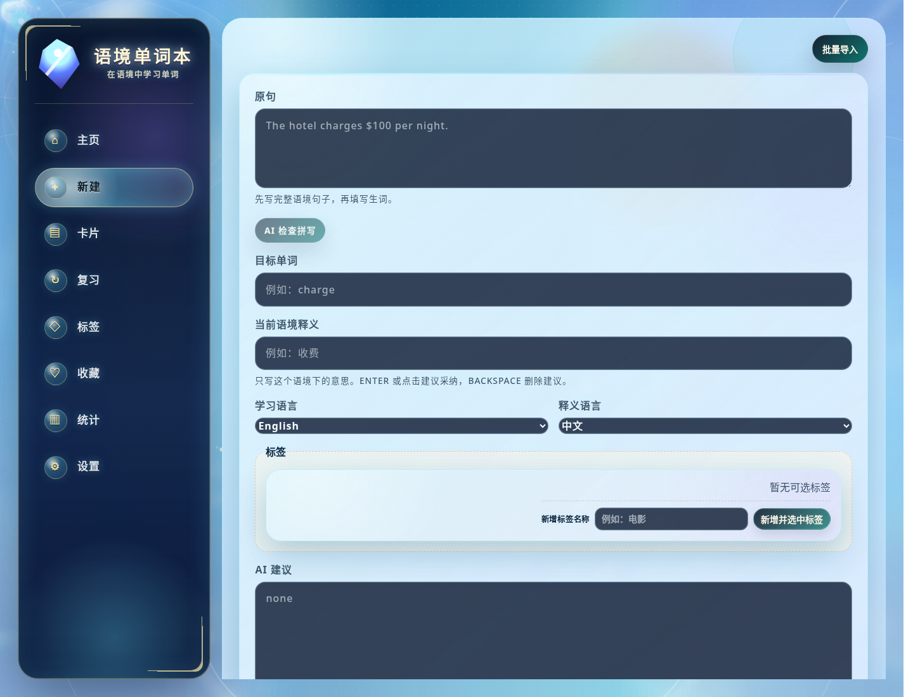

[中文](./README.md) | [English](./README.en.md) | [日本語](./README.ja.md) | [Español](./README.es.md) | [العربية](./README.ar.md) | [Deutsch](./README.de.md) | [Français](./README.fr.md) | [Italiano](./README.it.md) | [Latina](./README.la.md)

# Context Vocabulary Notebook（语境单词本）

看视频、听课程、读字幕时遇到生词，不只保存“单词本身”，还把它出现时的原句、上下文、截图、音频/视频片段、备注和标签一起保存下来。

复习时，你看到的不是一个孤立单词，而是当时真正遇到它的场景。

适合你，如果你：

- 经常看外语视频、课程、影视、播客或听力材料。
- 想做类似 Anki 的间隔复习，但希望卡片带原句、截图和媒体片段。
- 想把学习数据放在自己电脑里，不想为了单词本注册云账号。
- 需要从本地视频、音频、图片里辅助识别句子，再手动整理成卡片。

> 当前项目是本地 Web 应用。默认数据保存在你电脑上的 SQLite 数据库和 `uploads/` 文件夹里，不需要云账号。

## Demo



## 你可以用它做什么

- 围绕真实语境制卡：目标单词、原句、语境释义、备注、标签。
- 保存本地媒体附件：视频 `mp4`、音频 `mp3`、图片 `jpg / png / webp`。
- 批量导入剪辑：一次导入多个视频、音频、图片片段，逐条检查识别结果并制卡。
- 本地 OCR/STT 辅助：可配置 ffmpeg、Tesseract、whisper.cpp，从图片/视频帧/音频里识别句子。
- 同一词义可关联多个语境实例，适合记录“同一个意思在不同材料里怎么用”。
- 使用 FSRS 间隔复习，让单词回到你遇到它的上下文里。
- 搜索、标签筛选、收藏、统计、ZIP 导入导出。
- 可选 AI 建议：配置 OpenAI-compatible API 后，可辅助生成语境释义、用法说明、整句翻译、词形还原和拼写检查。

## 数据位置与磁盘占用提醒

请先选好安装目录。应用默认把数据库、上传文件和配置都放在运行目录下。

默认本地数据：

```text
data/context-vocabulary-notebook.sqlite
uploads/
.env
```

注意：上传视频、音频、截图后，`uploads/` 可能持续变大。Whisper 模型也可能占用几百 MB 到数 GB。

不建议放在这些位置运行：

- `/usr/local`、`/opt` 等通常需要 `sudo` 或 root 权限的目录。
- `C:\Program Files` 等系统保护目录。
- 临时目录、下载缓存目录、会被系统或清理工具自动删除的位置。
- 空间很小、同步规则不清楚、可能被网盘自动清理或限额的位置。

建议放在自己能长期保存的位置，例如：

```text
D:\study\context-vocabulary-notebook
E:\study\context
$HOME/context-vocabulary-notebook
```

## 一键安装

先进入你想放项目文件的空目录，再运行对应系统命令。脚本会把项目安装到当前目录；如果目录里已经是本项目，会自动更新。

| 系统 | 命令 |
|------|------|
| Linux / macOS / WSL | 见下方 Linux / macOS / WSL 命令 |
| Windows PowerShell | 见下方 Windows PowerShell 命令 |

### Linux / macOS / WSL

```bash
curl --retry 5 --retry-delay 2 --retry-connrefused -fsSL https://raw.githubusercontent.com/yaqxuan/context-vocabulary-notebook/main/scripts/install.sh | bash
```

### Windows PowerShell

```powershell
irm https://raw.githubusercontent.com/yaqxuan/context-vocabulary-notebook/main/scripts/install.ps1 -ErrorAction Stop | iex
```

安装完成后启动：

```bash
npm run dev
```

浏览器打开：

```text
http://localhost:5173
```

后端健康检查：

```text
http://localhost:3107/api/health
```

## 更新到最新版

进入当初安装项目文件的目录后运行：

Linux / macOS / WSL / Git Bash：

```bash
git pull --ff-only
npm ci
npm run build
npm run dev
```

Windows PowerShell：

```powershell
git pull --ff-only
npm ci
npm run build
npm run dev
```

也可以重新运行一键安装命令。脚本发现当前目录已经是本项目时，会自动执行更新、安装依赖和构建。

## 本地 OCR / 语音识别（可选）

核心单词本不强制安装 OCR/STT。你可以先手动制卡和复习；只有需要“从视频、音频、图片里自动识别原句”时，才需要配置这些工具。

本地识别用到：

- ffmpeg：从视频里提取音频。
- Tesseract：识别图片或视频帧里的文字。
- whisper.cpp + Whisper 模型：识别音频或视频里的语音。

### 一键配置本地识别（推荐先试）

在项目目录里运行：

Linux / macOS / WSL：

```bash
curl --retry 5 --retry-delay 2 --retry-connrefused -fsSL https://raw.githubusercontent.com/yaqxuan/context-vocabulary-notebook/main/scripts/install-recognition.sh | bash
```

Windows PowerShell：

```powershell
$env:CVN_TESSERACT_LANG='eng'; irm https://raw.githubusercontent.com/yaqxuan/context-vocabulary-notebook/main/scripts/install-recognition-windows.ps1 -ErrorAction Stop | iex
```

如果要识别中文和英文字幕，可把语言改成：

```powershell
$env:CVN_TESSERACT_LANG='eng+chi_sim'; irm https://raw.githubusercontent.com/yaqxuan/context-vocabulary-notebook/main/scripts/install-recognition-windows.ps1 -ErrorAction Stop | iex
```

脚本完成后，在应用设置页点击本地识别卡片里的 **I installed it, check again**。新版会重新读取 `.env`，通常不需要手动重启后端。

### 模型和磁盘占用

Whisper 模型比较大，下载时间取决于网络：

- `tiny` / `base`：体积小、速度快，适合试用，准确率较低。
- `small` / `medium`：准确率更好，磁盘和 CPU 占用更高。
- `large`：很大，普通电脑可能很慢，不适合作为默认选择。

Windows 识别安装脚本默认下载 `ggml-small.bin`，约数百 MB。

### 手动配置本地识别

如果一键配置失败，或者你想自己管理工具路径，可手动安装后在 `.env` 写入：

```env
CVN_FFMPEG_PATH=/absolute/path/to/ffmpeg

CVN_STT_PROVIDER=whisper.cpp
CVN_WHISPER_CPP_PATH=/absolute/path/to/whisper-cli
CVN_WHISPER_CPP_MODEL=/absolute/path/to/ggml-small.bin
CVN_WHISPER_CPP_TIMEOUT_MS=120000

CVN_OCR_PROVIDER=tesseract
CVN_TESSERACT_PATH=/absolute/path/to/tesseract
CVN_TESSERACT_LANG=eng
CVN_TESSERACT_TIMEOUT_MS=30000
```

Windows 路径示例：

```env
CVN_FFMPEG_PATH=E:\study\context\tools\ffmpeg\bin\ffmpeg.exe
CVN_WHISPER_CPP_PATH=E:\study\context\tools\whisper.cpp\Release\whisper-cli.exe
CVN_WHISPER_CPP_MODEL=E:\study\context\models\ggml-small.bin
CVN_TESSERACT_PATH=E:\study\context\tools\tesseract\tesseract.exe
CVN_TESSERACT_LANG=eng+chi_sim
```

## 高级安装选项

### 指定安装目录

Linux / macOS / WSL：

```bash
export CVN_HOME="$HOME/context-vocabulary-notebook"
curl --retry 5 --retry-delay 2 --retry-connrefused -fsSL https://raw.githubusercontent.com/yaqxuan/context-vocabulary-notebook/main/scripts/install.sh | bash
```

Windows PowerShell：

```powershell
$env:CVN_HOME = "C:\path\to\empty-folder"
irm https://raw.githubusercontent.com/yaqxuan/context-vocabulary-notebook/main/scripts/install.ps1 -ErrorAction Stop | iex
```

### 让核心安装脚本尝试补齐可选工具

这些不是普通用户首次安装必须做的事。需要时再用。

Linux / macOS / WSL：

```bash
export CVN_INSTALL_FFMPEG=1
export CVN_INSTALL_TESSERACT=1
curl --retry 5 --retry-delay 2 --retry-connrefused -fsSL https://raw.githubusercontent.com/yaqxuan/context-vocabulary-notebook/main/scripts/install.sh | bash
```

Windows PowerShell：

```powershell
$env:CVN_INSTALL_FFMPEG = "1"
$env:CVN_INSTALL_TESSERACT = "1"
irm https://raw.githubusercontent.com/yaqxuan/context-vocabulary-notebook/main/scripts/install.ps1 -ErrorAction Stop | iex
```

脚本源码：

- Linux / macOS / WSL: https://github.com/yaqxuan/context-vocabulary-notebook/blob/main/scripts/install.sh
- Windows PowerShell: https://github.com/yaqxuan/context-vocabulary-notebook/blob/main/scripts/install.ps1

## 手动安装

如果一键脚本无法补齐环境，可先手动安装 Node.js 22 LTS、npm、Git，以及可能需要的 native build tools，然后执行下面命令。

Linux / macOS / WSL / Git Bash：

```bash
cd "$HOME"
git clone https://github.com/yaqxuan/context-vocabulary-notebook.git context-vocabulary-notebook
cd context-vocabulary-notebook
cp .env.example .env
npm ci
npm run dev
```

Windows PowerShell：

```powershell
Set-Location $HOME
git clone https://github.com/yaqxuan/context-vocabulary-notebook.git context-vocabulary-notebook
Set-Location context-vocabulary-notebook
Copy-Item .env.example .env
npm ci
npm run dev
```

浏览器打开：

```text
http://localhost:5173
```

## 常见问题

### 一键安装失败怎么办

- 如果提示命令不存在，请关闭终端后重新打开，再运行一次安装命令。
- Linux / WSL 如果 `apt-get update` 报 Docker、Chromium、Snap、GPG key 等错误，通常是系统已有 apt 源或未完成包配置异常，不是本项目依赖这些软件。可以先修复/禁用对应 apt 源，或手动安装 Git、Node.js 22 LTS 和 npm 后重试。
- macOS 如果弹出 Xcode Command Line Tools 安装窗口，请点击“安装”，完成后重新运行安装命令。
- Windows 如果 `npm ci` 在 `better-sqlite3` 处失败，通常需要 Python 和 Visual Studio Build Tools / MSVC；如果不熟悉这些工具，建议改用 WSL。

### 页面能打开，但本地识别仍显示未配置

先确认识别安装脚本已经完成，并且 `.env` 中有对应 `CVN_*` 路径。然后在设置页点击 **I installed it, check again**。

如果仍不行：

- 确认应用是从同一个项目目录启动的。
- 确认没有旧的 `3107` 后端进程占用端口。
- 重新运行 `npm run dev` 后再刷新页面。

### 端口被占用

修改后端端口：

```env
PORT=3108
```

Linux / macOS / WSL / Git Bash 修改前端端口：

```bash
CLIENT_PORT=5174 npm run dev
```

Windows PowerShell 修改前端端口：

```powershell
$env:CLIENT_PORT = "5174"
npm run dev
```

### 剪辑里没有可见字幕，识别不到原句

如果视频画面里没有字幕，或字幕很小/模糊，OCR 可能识别不到句子；这时依赖语音识别。请确认 ffmpeg、whisper.cpp 和 `CVN_WHISPER_CPP_MODEL` 可用。如果音频里也没有清晰语音，只能手动填写原句。

如果看到 `Audio extraction failed`，通常说明 ffmpeg 不可用、路径不正确，或源视频/音频文件无法被 ffmpeg 读取。

### Tesseract 语言数据缺失

如果 OCR 报语言数据缺失，说明已找到 Tesseract，但没有安装对应 traineddata。常见语言码：

- 英语：`eng`
- 简体中文：`chi_sim`
- 日语：`jpn`
- 韩语：`kor`
- 法语：`fra`
- 德语：`deu`
- 西班牙语：`spa`
- 俄语：`rus`

多语言可用：

```env
CVN_TESSERACT_LANG=eng+chi_sim
```

### Whisper 模型路径未配置

`CVN_WHISPER_CPP_MODEL` 没有默认模型。请下载 whisper.cpp 支持的 ggml 模型，并在 `.env` 中写入绝对路径。

## 数据与备份

默认数据都在项目目录下：

```text
data/context-vocabulary-notebook.sqlite
uploads/
.env
```

备份时建议一起保存：

```bash
tar -czf vocabulary-notebook-backup.tar.gz data uploads .env
```

恢复时把这些文件放回同一个项目目录，再启动应用。

应用内也提供 ZIP 导入导出：

- 完整备份：包含卡片、语境、媒体、标签、收藏、复习状态、FSRS 状态、复习记录和用户设置。
- 纯卡片分享：不包含个人复习进度、收藏状态、用户设置。

AI API Key 属于本地敏感配置，不会随导出文件带走；换设备后需要重新填写。

## 媒体文件建议

| 类型 | 支持格式 | 建议大小 |
|------|----------|----------|
| 视频 | `mp4` | 单文件 300MB 以内 |
| 音频 | `mp3` | 单文件 50MB 以内 |
| 图片 | `jpg` / `png` / `webp` | 单文件 10MB 以内 |

## AI 建议配置

制卡页支持可选 AI 建议。需要在设置页添加 OpenAI-compatible API 配置：

- 显示名称
- Base URL
- API Key
- Model

说明：

- 不配置 AI 也可以正常手动制卡和复习。
- API Key 存在本地数据库中，界面会做遮罩显示。
- API Key 不会包含在导出文件里。
- AI 可用于制卡时建议语境释义、用法说明、整句翻译、词形还原和拼写检查。
- DeepSeek 等 OpenAI-compatible 文本模型不负责本地 OCR/STT；图片文字识别依赖 Tesseract，语音识别依赖 whisper.cpp。

## 环境要求

| 环境 | 要求 | 说明 |
|------|------|------|
| Node.js | 推荐 Node.js 22 LTS | 前端构建、开发服务和后端服务都依赖 Node.js。安装脚本会尝试补齐。 |
| npm | 跟随 Node.js 安装 | 仓库包含 `package-lock.json`，安装依赖使用 `npm ci`。 |
| Git | 克隆 GitHub 仓库时需要 | 安装脚本会检查并尝试补齐。 |
| 浏览器 | Chrome / Edge / Firefox / Safari 等现代浏览器 | 应用通过本地 Web 页面使用。 |
| C/C++ 构建工具 | 可能需要 | `better-sqlite3` 是 native module；如果没有可用预编译包，`npm ci` 会尝试本地编译。 |
| ffmpeg | 可选 | 视频/音频剪辑分析需要。 |
| Tesseract OCR | 可选 | 图片或视频帧 OCR 需要。 |
| whisper.cpp + Whisper 模型 | 可选 | 音频/视频语音识别需要。 |

### WSL / Windows 原生选择建议

- WSL 通常最稳：Node、Git、ffmpeg、Tesseract 和 native build tools 的安装路径更接近 Linux。
- Windows 原生 PowerShell 可以安装：脚本会复用已有 Git / Node.js / npm，缺少时才尝试 `winget`。
- STT 需要单独安装 whisper.cpp，并手动下载 Whisper ggml 模型；核心安装不默认下载模型。
- 如果 Windows 原生 `npm ci` 在 `better-sqlite3` 处失败，需要按提示安装 Python 和 Visual Studio Build Tools / MSVC，或改用 WSL。

## 环境变量

<!-- AUTO-GENERATED:ENV -->
| 变量 | 必填 | 默认值 | 说明 |
|------|------|--------|------|
| `PORT` | 否 | `3107` | 后端 Express 服务端口。Vite 开发服务会把 `/api` 代理到该端口。 |
| `DATABASE_PATH` | 否 | `./data/context-vocabulary-notebook.sqlite` | SQLite 数据库路径。相对路径会按项目根目录解析。 |
| `UPLOADS_DIR` | 否 | `./uploads` | 上传媒体文件保存目录。相对路径会按项目根目录解析。 |
| `CVN_FFMPEG_PATH` | 否 | `ffmpeg` | ffmpeg 可执行文件路径；Windows 本地 tools 安装可填绝对路径。 |
| `CVN_STT_PROVIDER` | 否 | `whisper.cpp` | 本地语音识别提供方；可设为 `whisper.cpp` 或 `disabled`。 |
| `CVN_WHISPER_CPP_PATH` | 否 | `whisper-cli` | whisper.cpp 可执行文件路径；如果系统只有旧版 `main`，可填 `main` 或绝对路径。 |
| `CVN_WHISPER_CPP_MODEL` | 本地 STT 需要 | 空 | Whisper 模型文件路径；安装脚本不会自动下载模型。 |
| `CVN_WHISPER_CPP_TIMEOUT_MS` | 否 | `120000` | whisper.cpp 单次识别超时时间。 |
| `CVN_OCR_PROVIDER` | 否 | `tesseract` | 本地 OCR 提供方；可设为 `tesseract` 或 `disabled`。 |
| `CVN_TESSERACT_PATH` | 否 | `tesseract` | Tesseract 可执行文件路径。 |
| `CVN_TESSERACT_LANG` | 否 | 按目标语言自动选择 | Tesseract 语言码，例如 `eng`、`chi_sim`、`eng+chi_sim`。 |
| `CVN_TESSERACT_TIMEOUT_MS` | 否 | `30000` | Tesseract 单次 OCR 超时时间。 |
| `CVN_CLIP_ANALYSIS_CLOUD_FALLBACK` | 否 | `0` | 本地剪辑识别失败时是否允许云端转写回退；默认关闭。 |
| `CVN_LOCAL_READINESS_TIMEOUT_MS` | 否 | 默认由服务端决定 | 本地识别 readiness 检查超时时间。 |
<!-- /AUTO-GENERATED:ENV -->

## 常用命令

<!-- AUTO-GENERATED:SCRIPTS -->
| 命令 | 说明 |
|------|------|
| `npm run dev` | 同时启动后端开发服务和 Vite 前端开发服务。 |
| `npm run dev:client` | 只启动 Vite 前端开发服务，默认监听 `0.0.0.0:5173`。 |
| `npm run dev:server` | 只启动后端 Express 开发服务，默认监听 `localhost:3107`。 |
| `npm run build` | 先执行类型检查，再构建前端和后端。 |
| `npm test` | 运行 Vitest 单元 / 集成测试。 |
| `npm run test:e2e` | 运行 Playwright E2E 测试；没有测试文件时也通过。 |
| `npm run typecheck` | 运行前端和 Node 侧 TypeScript 类型检查。 |
| `npm run lint` | 当前等同于 `npm run typecheck`。 |
<!-- /AUTO-GENERATED:SCRIPTS -->

## 开发说明

本项目技术栈：

- React + Vite
- Node.js + Express
- SQLite + better-sqlite3
- ts-fsrs
- Tailwind CSS
- Vitest
- Playwright

第一版坚持本地优先，不内置词库，不接词典，不做网站视频链接，不做同步。当前 V2 增加制卡时 AI 建议能力和本地剪辑识别辅助。

## 安装前说明与免责声明

据作者当前认知，本项目自有源码不包含任何恶意代码。安装脚本会检查本机环境，并在受支持的平台上尝试安装缺失依赖，例如 Git、Node.js 和 npm；native build tools 缺失时会给出处理建议，部分平台需要用户手动安装。

项目安装会通过系统包管理器和 npm 获取第三方软件与依赖。安装和使用过程中仍可能受到系统权限、网络状态、包管理器可用性、杀毒软件、企业设备策略、磁盘空间、第三方依赖供应链、Node native module 编译结果等因素影响。用户运行安装脚本、安装依赖、修改系统环境、上传和保存本地文件所产生的问题与后果，由用户自行承担。

如果脚本无法自动补齐环境，会输出缺少的工具和建议处理方式；此时需要用户按自己的系统手动安装后再重试。

## 许可证

本项目使用 MIT License。详见 [`LICENSE`](./LICENSE)。
