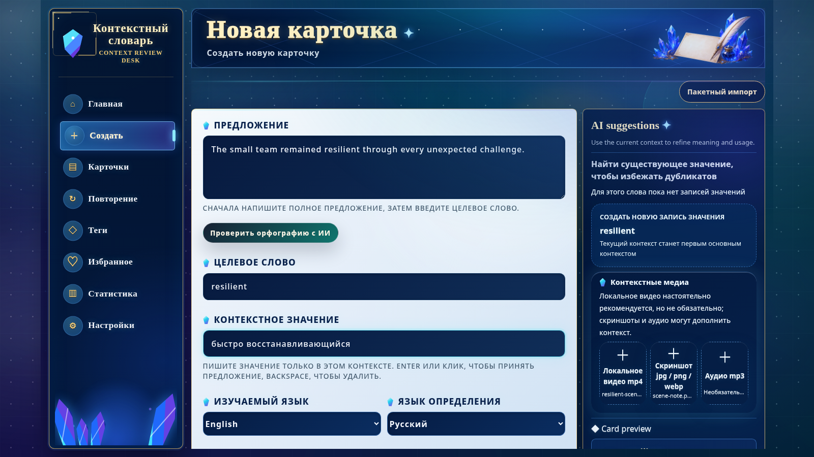

[English](./README.md) | [简体中文](./README.zh-CN.md) | [日本語](./README.ja.md) | [Español](./README.es.md) | [العربية](./README.ar.md) | [Deutsch](./README.de.md) | [Français](./README.fr.md) | [Italiano](./README.it.md) | [한국어](./README.ko.md) | [Русский](./README.ru.md) | [Latina](./README.la.md)

# Context Vocabulary Notebook (контекстный словарь)

Сохраняйте слово вместе с предложением, изображением, аудио или видео, где вы его встретили.

<!-- README:OVERVIEW -->
## Запоминайте слова в настоящем контексте

Context Vocabulary Notebook — локальное приложение с самостоятельным размещением. Карточка
объединяет слово, значение в текущем контексте, исходное предложение, теги, заметки и медиа.
FSRS планирует повторение, а пользователь отвечает `Again` или `Good`.

Это не готовый словарь, не облачная синхронизация и не нативная настольная программа.
Это локальное веб-приложение для слов, которые вы собираете сами.

<!-- README:PREVIEW -->
## Интерфейс



Другие экраны: [карточка](./docs/demo/02-context-card.png),
[повторение](./docs/demo/03-review.png), [статистика](./docs/demo/04-statistics.png).

<!-- README:WORKFLOW -->
## Процесс обучения

1. Запишите исходную фразу, слово и его значение в контексте.
2. Добавьте `mp4`, `mp3`, `jpg`, `png` или `webp`.
3. Организуйте материал тегами, избранным, заметками, поиском и фильтрами.
4. Оцените повторение как `Again / Good`; FSRS выберет следующий интервал.
5. Следите за объёмом, точностью, тегами и динамикой оценок.

Пакетный импорт обрабатывает несколько **локальных MP4-клипов** и позволяет проверить
результат распознавания перед сохранением. URL видеосайтов не поддерживаются.

<!-- README:FEATURES -->
## Возможности

| Область | Что доступно |
|---|---|
| Карточки | Фраза, значение, заметки, теги и несколько примеров контекста. |
| Медиа | Локальные `mp4`, `mp3`, `jpg`, `png`, `webp`. |
| Повторение | FSRS, `Again / Good`, дневной прогресс, воспроизведение медиа. |
| Библиотека | Поиск, фильтры, избранное, теги, редактирование, статус усвоения. |
| Статистика | Количество повторений, точность, итоги по месяцам, теги и оценки. |
| Перенос | ZIP для личной резервной копии или обмена карточками. |
| Распознавание | Необязательные ffmpeg, Tesseract OCR и whisper.cpp STT. |
| AI | Необязательные подсказки через OpenAI-compatible API. |

<!-- README:QUICKSTART -->
## Быстрый запуск

Нужны Git, npm и Node.js `20.19+` или `22.12+` (рекомендуется Node.js 22 LTS).

Запускайте установщик из пустого каталога. Проект устанавливается прямо в текущий
каталог и не создаёт вложенную папку `context-vocabulary-notebook`.

Linux, macOS или WSL:

```bash
curl --retry 5 --retry-delay 2 --retry-connrefused -fsSL https://raw.githubusercontent.com/yaqxuan/context-vocabulary-notebook/main/scripts/install.sh | bash
```

Windows PowerShell:

```powershell
irm https://raw.githubusercontent.com/yaqxuan/context-vocabulary-notebook/main/scripts/install.ps1 -ErrorAction Stop | iex
```

Запуск:

```bash
npm run dev
```

Откройте <http://localhost:5173>. Проверка API:
<http://localhost:3107/api/health>. Сначала создайте одну карточку вручную.

<!-- README:OPTIONAL -->
## Необязательные распознавание и AI

ffmpeg извлекает медиа, Tesseract читает видимый текст, а whisper.cpp с моделью Whisper
распознаёт речь. Из-за размера моделей распознавание устанавливается отдельно от приложения.

```bash
curl --retry 5 --retry-delay 2 --retry-connrefused -fsSL https://raw.githubusercontent.com/yaqxuan/context-vocabulary-notebook/main/scripts/install-recognition.sh | CVN_TESSERACT_LANG=rus bash
```

```powershell
$env:CVN_TESSERACT_LANG='rus'; irm https://raw.githubusercontent.com/yaqxuan/context-vocabulary-notebook/main/scripts/install-recognition-windows.ps1 -ErrorAction Stop | iex
```

AI использует настроенный вами OpenAI-compatible API. Для ручного создания карточек и
повторения OCR, STT и AI не требуются.

<!-- README:PRIVACY -->
## Конфиденциальность и данные

По умолчанию данные остаются в каталоге установки:

```text
data/context-vocabulary-notebook.sqlite
uploads/
.env
```

Встроенной облачной синхронизации нет. Ручная работа и локальные OCR/STT оставляют данные на
компьютере. Настроенный сетевой AI-провайдер получает текст для подсказок и аудио для
транскрипции карточки. Только при `CVN_CLIP_ANALYSIS_CLOUD_FALLBACK=1` после локального сбоя
могут отправляться кадры или аудио клипа. API-ключ хранится локально и не попадает во
встроенный ZIP-экспорт.

<!-- README:DOCS -->
## Документация

- [Полное руководство на английском](./docs/USER_GUIDE.md)
- [Полное руководство на китайском](./docs/USER_GUIDE.zh-CN.md)
- [Участие в разработке](./CONTRIBUTING.md)
- [Политика безопасности](./SECURITY.md)
- [Кодекс поведения](./CODE_OF_CONDUCT.md)

Обновление, Windows/WSL, OCR/STT, переменные среды, резервное копирование и устранение
неполадок описаны в полном руководстве.

<!-- README:STATUS -->
## Состояние проекта

Это ранняя предварительная версия для локального самостоятельного размещения. Перед крупными
изменениями сохраните `data/`, `uploads/` и `.env`.

Языки интерфейса: английский, упрощённый китайский, японский, корейский, французский,
немецкий, испанский и русский.

<!-- README:CONTRIBUTING -->
## Участие

Приветствуются отчёты об ошибках, конкретные предложения, переводы и протестированные PR.
Сначала прочитайте [CONTRIBUTING.md](./CONTRIBUTING.md) и не публикуйте личные слова,
медиа, базу данных или API-ключи.

<!-- README:LICENSE -->
## Лицензия

[MIT](./LICENSE)
