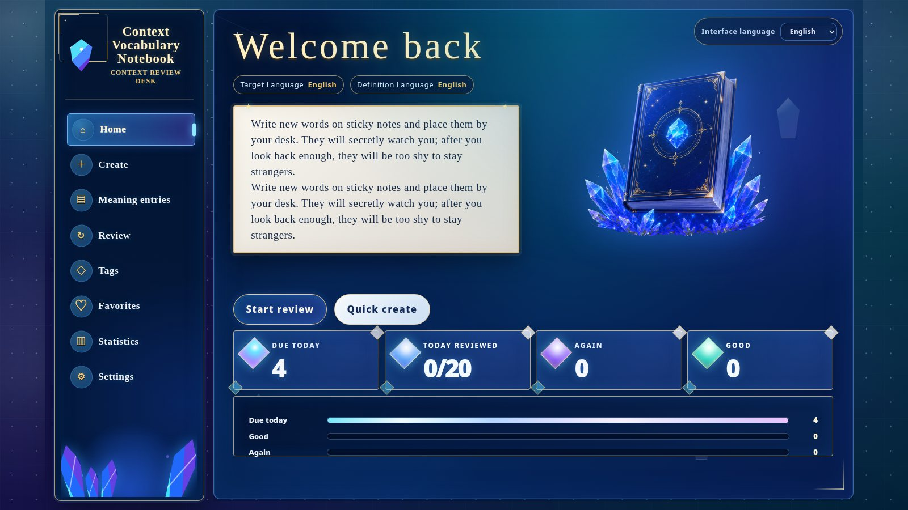
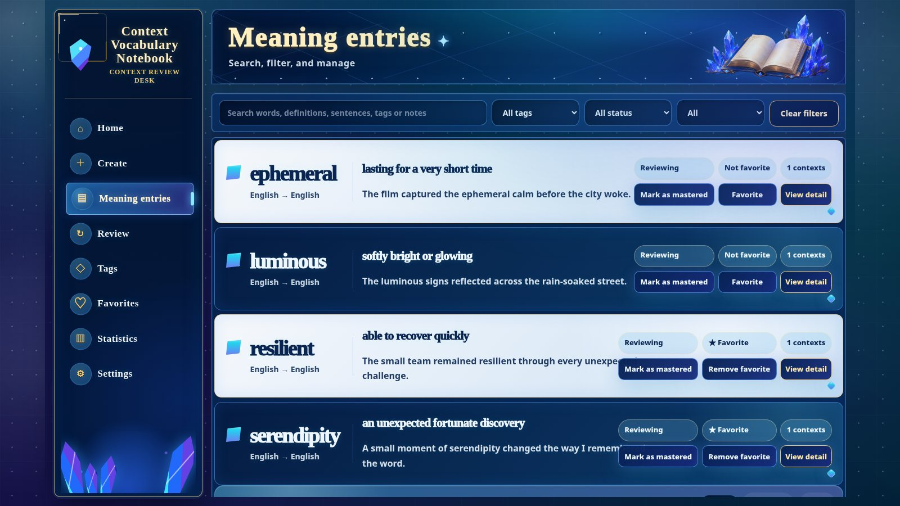
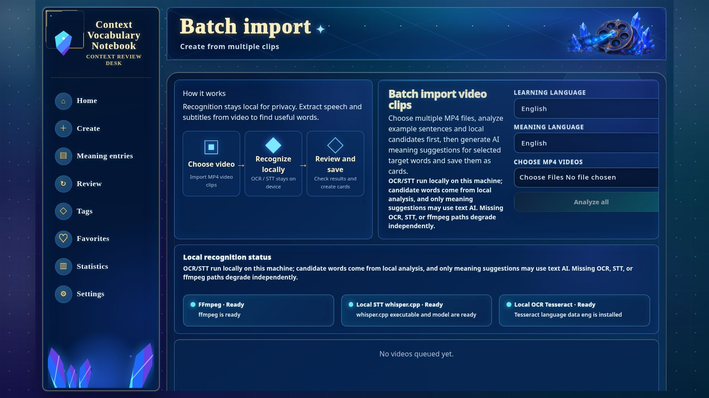
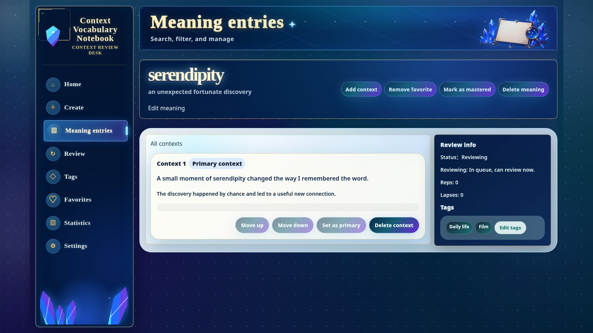
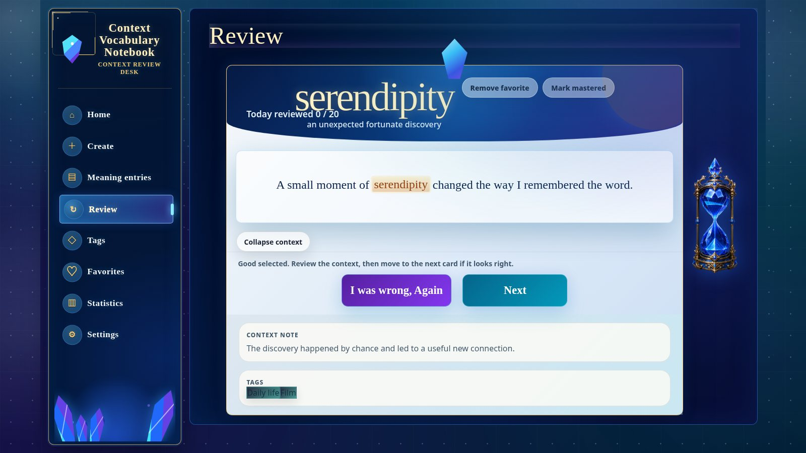
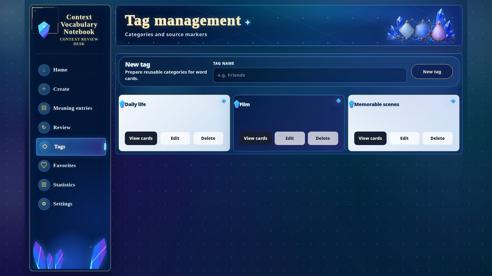
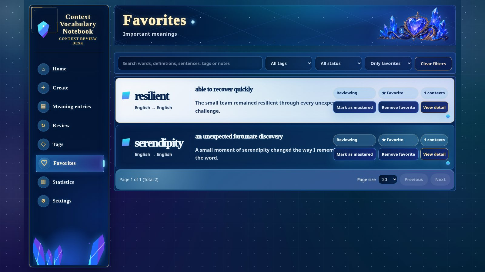
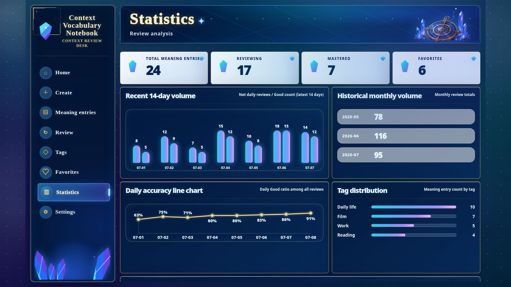
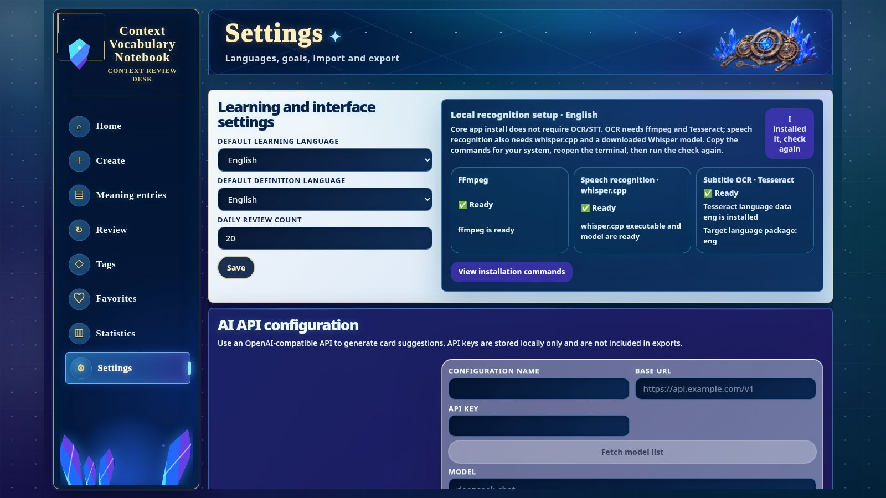

# Application screen catalog

This English-only catalog shows every current application page in Context
Vocabulary Notebook. Screens use generated demonstration data and contain no
personal vocabulary, API keys, or private media.

## Contents

1. [Home](#home)
2. [Create card](#create-card)
3. [Card library](#card-library)
4. [Batch MP4 import](#batch-mp4-import)
5. [Card detail](#card-detail)
6. [Review](#review)
7. [Tags](#tags)
8. [Favorites](#favorites)
9. [Statistics](#statistics)
10. [Settings](#settings)

## Home

See today’s due count, review progress, language preferences, and the quickest
paths to reviewing or creating a card.

## Create card

Save a sentence, target word, contextual meaning, languages, tags, notes, and
optional image, audio, or video media in one guided form.

## Card library

Search and filter the complete vocabulary library, inspect the current context,
and change review, mastery, or favorite state without leaving the list.

## Batch MP4 import

Queue local MP4 clips, check local recognition readiness, inspect detected text
and speech candidates, and confirm each result before saving a card.

## Card detail

Read every saved context for a word, replay attached media, manage tags and
review state, and edit or delete the card.

## Review

Review the due sentence and optional media, reveal the contextual meaning, then
choose `Again` or `Good` so FSRS can schedule the next interval.

## Tags

Create reusable vocabulary groups, see how many cards each tag contains, and
rename or remove tags as the library evolves.

## Favorites

Open a focused version of the card library that contains only cards marked as
favorites while preserving the same search and filtering tools.

## Statistics

Track card totals, daily review volume, accuracy, monthly history, tag
distribution, and `Again / Good` rating trends.

## Settings

Choose learning defaults, inspect local OCR/STT readiness, configure optional
OpenAI-compatible providers, and export or import local data.

---

Return to the [English README](../README.md) or continue with the
[English user guide](./USER_GUIDE.md).
